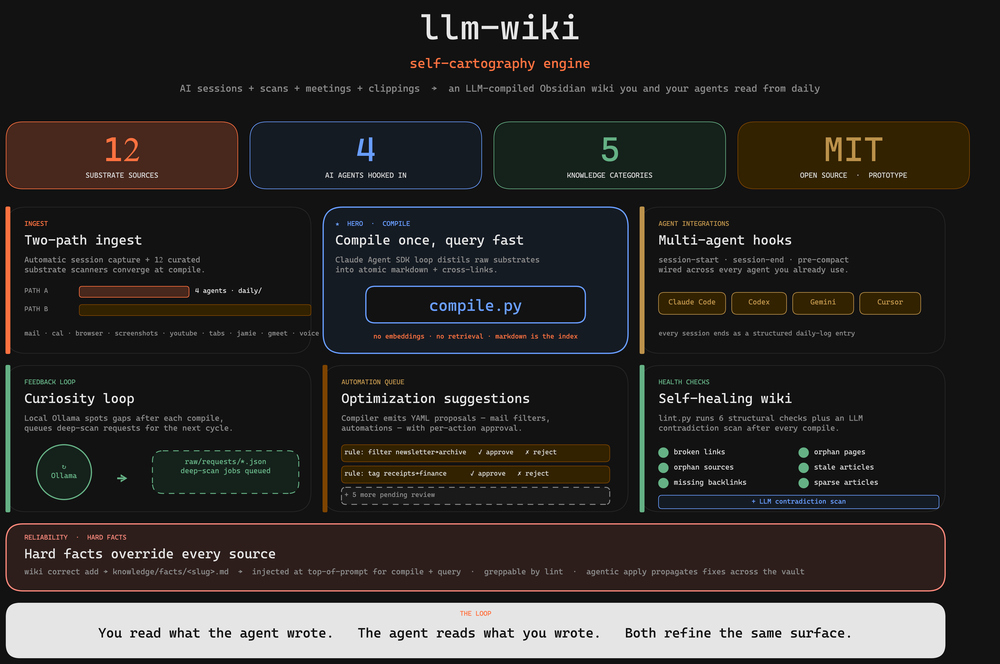
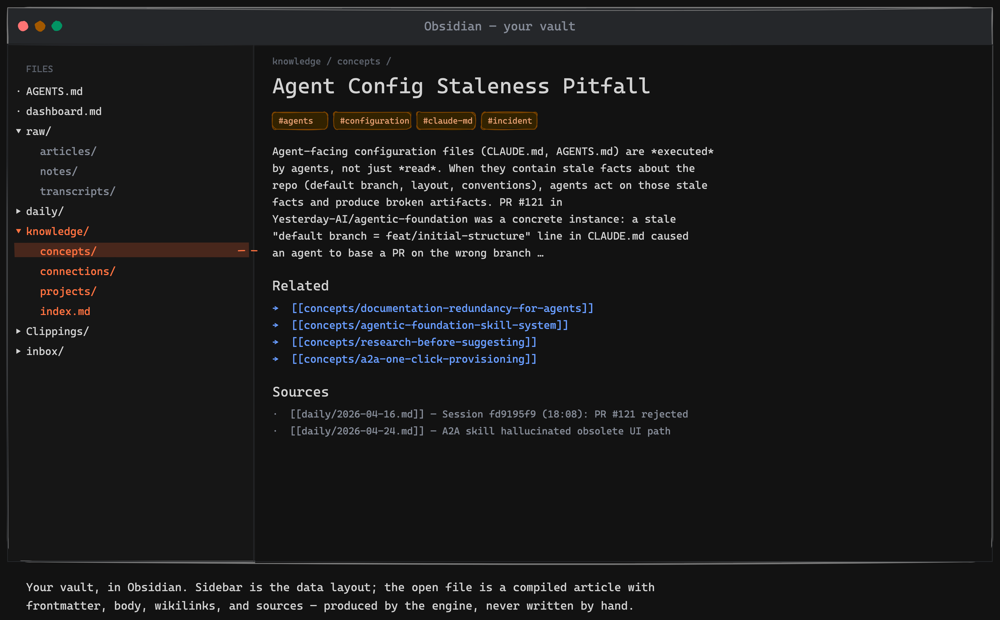

<p align="center">
  
</p>

<p align="center">
  <em>Self-cartography engine.</em>
</p>

<p align="center">
  Turn your scattered personal data into a queryable Obsidian wiki. You and your agents read from the same surface.
</p>

<p align="center">
  <a href="./LICENSE"></a>
  
  
  
  
  
</p>

> [!WARNING]
> **Heavy prototype development.** This is a single-author scratch space, not a stable tool. Architecture, CLI surface, file layout, and config schema can break at any time without notice or migration path. No semver, no deprecation cycle, no compatibility promises. If you install it, expect to read commits before pulling.

<table align="center">
  <tr>
    <td align="center"><strong>3 + 5</strong><br/>collectors + legacy scanners</td>
    <td align="center"><strong>6</strong><br/>skills bundled</td>
    <td align="center"><strong>MIT</strong><br/>open source</td>
  </tr>
</table>

> Yesterday's Claude Code session is already a daily-log entry. This week's screenshots already have a summary article. Open a fresh agent session and the wiki index loads before you type. **You read what the agent wrote. The agent reads what you wrote. Both refine the same surface.**

## Contents

- [What is this](#what-is-this) · [Why it exists](#why-it-exists) · [What you get](#what-you-get)
- [What it looks like in Obsidian](#what-it-looks-like-in-obsidian) · [Two ingest paths converge at compile](#two-ingest-paths-converge-at-compile) · [What a compiled article looks like](#what-a-compiled-article-looks-like) · [The defining choice](#the-defining-choice-compile-once-query-fast)
- [Engine vs. vault split](#engine-vs-vault-split) · [Install](#install) · [Update](#update) · [Running scripts manually](#running-scripts-manually)
- [Documentation map](#documentation-map) · [Security](#security) · [CLI Reference](#cli-reference) · [For contributors](#for-contributors)

## What is this

An opinionated **knowledge-compilation engine** for personal substrates. Drop raw materials in — daily session logs, web clippings, screenshots, emails, calendars, browser history, HTML files — and a Claude Agent SDK loop compiles them into atomic Markdown articles with wikilinks. Renders as a navigable wiki inside [Obsidian](https://obsidian.md). The same wiki gets injected into every AI-agent session as context, so the loop closes: you read what you wrote, the agent reads what it wrote, both refine the same surface.

The vault holds **data**. The `.wiki/` directory holds the **engine**. They never mix on disk.

**What this isn't.** Not a vector database, not a RAG service, not a Notion / Logseq / Mem replacement, not a docs-site generator, not a team wiki. It is a *compile loop* for one operator's substrates, output as plain Markdown that any tool can read.

## Why it exists

A solo knowledge worker's thinking lives in too many partial substrates: daily notes capture *what happened*, AI-agent memories capture *working thought*, clippings capture *curiosity*, screenshots and calendars capture *everything else*. Each is queryable in isolation, but not as a whole — and most are illegible even to the person who produced them.

Existing tools either solve a slice or solve a different problem:

- **[Karpathy's LLM Wiki](https://gist.github.com/karpathy/442a6bf555914893e9891c11519de94f)** — the `raw/` → `knowledge/` shape and the compile-don't-retrieve choice; a sketch, not a working pipeline.
- **[claude-memory-compiler](https://github.com/coleam00/claude-memory-compiler)** (Cole Medin) — the session-capture pattern; only handles AI-agent memories, doesn't ingest other substrates.
- **Obsidian** — manual curation, no compilation.
- **Notion** — team docs, not personal cartography.
- **RAG systems** — retrieval, not compilation; weak cross-doc reasoning.

llm-wiki is the **compilation layer** between raw substrates and active consumption — by humans reading and by agents prompting. It is not an archive to be left behind; it is a working surface that gets refined by being used.

## What you get

- **Two-path ingest** — automatic session capture (hooks → `daily/`) and substrate-source writers (Registry-discovered Collectors + legacy scanners + clipper + manual drop → `raw/`) converge at one compiler. Email, Jamie and Google Meet ride the formal Collector Protocol (`SPEC` + `@register` + `run()`); the remaining `scan-*.py` scripts are scheduled for the same migration.
- **Compile once, query fast** — knowledge is distilled into Markdown wikilinks at compile time. No embedding step, no retrieval per query.
- **Multi-agent hooks** — `session-start` / `session-end` / `pre-compact` wired into Claude Code, Codex, Gemini, and Cursor. Every session ends as a structured daily-log entry.
- **Curiosity loop** — a small local Ollama model spots gaps after each compile and queues deep-scan requests for the next cycle.
- **Optimization suggestions** — the compiler proposes YAML automations (e.g. mail-filter rules) with per-action approval before execution.
- **Self-healing wiki** — `lint.py` runs 8 structural checks plus an LLM contradiction scan, so the wiki stays consistent as it grows.
- **Engine / vault split** — engine code, prompts, hooks, runtime state, and venv all live under `<vault>/.wiki/`. The vault root stays clean.
- **One install, one CLI, one venv** — `wiki setup` + `wiki update` + `wiki status` cover the full lifecycle.



<sub>High-level dashboard. For the full cognitive-architecture diagram see [`docs/architecture.png`](docs/architecture.png). Both rendered from `.excalidraw` files in [`docs/`](docs/).</sub>

## What it looks like in Obsidian



The sidebar is the data layout — `raw/`, `daily/`, `knowledge/` — exactly the folders the compiler creates and reads. The open file is a compiled article: frontmatter, body, wikilinks, and sources, none of it written by hand.

## Two ingest paths converge at compile

```text
PATH A — Automatic capture                PATH B — Curated sources
─────────────────────────────             ──────────────────────────────────
session-start / session-end /             Collectors (Registry):
pre-compact hooks attach to every         · email            (multi-backend mailboxes)
Claude Code / Codex / Gemini /            · jamie            (Jamie AI meetings)
Cursor session.  flush.py extracts        · gmeet            (Google Meet / Gemini transcripts)
the conversation transcript and           Scanners (legacy CLI, pending port):
appends a structured entry to             · scan-calendar    (Thunderbird SQLite)
daily/YYYY-MM-DD.md.                      · scan-browser     (Firefox + Chrome)
                                          · scan-screenshots (Vision LLM)
                                          · scan-tabs        (Firefox STG)
                                          · scan-youtube     (yt-dlp + gemma4 visual)

                                          Other writers:
            │                             · clippings-sweep  (Obsidian Web Clipper)
                                          · ingest-html      (file or URL)
                                          · process-inbox    (LLM-classified drop)
            ▼                                          │
     daily/YYYY-MM-DD.md                               ▼
                                          raw/{articles,papers,notes,transcripts,
                                              audio,requests,suggestions}/
            │                                          │
            └──────────────┐    ┌──────────────────────┘
                           ▼    ▼
                  ┌────────────────────┐
                  │     compile.py     │   Claude Agent SDK loop.
                  │                    │   Reads index.md + AGENTS.md (vault),
                  │                    │   walks raw/ + daily/, distils into
                  │                    │   atomic articles + cross-links.
                  └────────────────────┘
                           │
                           ▼
                  ┌────────────────────┐
                  │     knowledge/     │   LLM owns; you and your agents read.
                  │  concepts/         │
                  │  connections/      │   ← cross-source links
                  │  projects/         │
                  │  people/           │
                  │  qa/               │
                  │  facts/            │   ← human-owned hard facts (override sources)
                  │  index.md          │   ← master catalogue
                  └────────────────────┘
```

After every compile, two side loops run on the new article:

- **Curiosity loop** — a small local Ollama model spots gaps and writes JSON deep-scan requests to `raw/requests/`. The next compile cycle picks one up and fills the gap.
- **Optimization suggestions** — the compiler emits YAML proposals to `raw/suggestions/` for repeatable manual actions (e.g. mail filter rules). `suggestions/cli.py` applies them only after explicit per-action approval.

`lint.py` watches the wiki itself: 8 structural checks (broken links, orphan pages, orphan sources, stale articles, missing backlinks, article type, sparse articles, fact violations) plus one LLM-driven contradiction scan.

When raw sources contradict reality — a Slack thread that calls a project by its old name, an old memo that claims a never-won award — `wiki correct` lets you write a **hard fact** to `knowledge/facts/<slug>.md`. Hard facts inject into compile + query prompts at the highest authority, so future compilations honour them automatically. `wiki correct apply <slug>` then spawns an agent that walks the existing wiki, strikes contaminated claims, fixes wikilinks, and — for disambiguation facts — renames files. Raw sources stay immutable; only `knowledge/` (and minimal correction notes in `daily/`) are touched.

## What a compiled article looks like

A real `knowledge/concepts/agent-config-staleness.md` from a working vault — illustrative excerpt:

```markdown
---
title: "Agent Config Staleness Pitfall"
aliases: [stale-claude-md, stale-agent-config, wrong-base-pr-incident]
tags: [agents, configuration, claude-md, incident]
sources:
  - "daily/2026-04-16.md"
  - "daily/2026-04-24.md"
created: 2026-04-16
updated: 2026-05-02
---

# Agent Config Staleness Pitfall

Agent-facing configuration files (CLAUDE.md, AGENTS.md) are *executed* by
agents, not just *read*. When they contain stale facts about the repo
(default branch, layout, conventions), agents act on those stale facts and
produce broken artifacts. PR #121 in `Yesterday-AI/agentic-foundation` was
a concrete instance: a stale "default branch = `feat/initial-structure`"
line in `CLAUDE.md` caused an agent to base a PR on the wrong branch …

## Key Points

- **CLAUDE.md is not documentation — it's instructions.** Agents follow it
  like a runbook. Outdated facts produce outdated actions.
- **Counter-pattern to [[concepts/documentation-redundancy-for-agents]]:**
  redundancy protects against agents *missing* a rule; freshness protects
  against agents *following* an outdated rule. Both matter.

## Related

- [[concepts/agentic-foundation-skill-system]] — same repo, flat skills layout
- [[concepts/research-before-suggesting]] — verify state, don't trust assumed state
- [[concepts/a2a-one-click-provisioning]] — second instance of the same bug class

## Sources

- [[daily/2026-04-16.md]] — Session `fd9195f9` (18:08): PR #121 rejected
- [[daily/2026-04-24.md]] — A2A skill hallucinated obsolete UI path
```

Three things to notice:

- **Frontmatter** is structured (aliases, tags, sources, dates) so Dataview queries hit it cleanly.
- **`[[wikilinks]]`** point both *into* the wiki (`concepts/...`) and *back to durable sources* (`daily/...`, `raw/notes/...`, `raw/articles/...`, `raw/transcripts/...`) — the audit trail is part of the article, not a metadata field.
- **The article is atomic.** It argues one idea, cites two different days' sessions, and links to four sibling concepts. The compiler chose this granularity from the raw substrates; nothing is hand-curated.

## The defining choice: compile once, query fast

Knowledge is distilled into Markdown wikilinks at compile time — no embedding step, no retrieval at every query.

| Approach | Cost per query | Latency | Cross-doc reasoning |
|---|---|---|---|
| RAG | re-embed + retrieve every time | seconds | weak — chunks are isolated |
| llm-wiki | one-time compile per source | ms — it's already markdown | strong — LLM saw all sources during compile |

**Speed compounds.** Every query is a Markdown read, so the wiki ends up read more often than it's written — by you, and by every agent you give vault access to. That inversion (output → input ratio greater than 1) is the point.

Inspired by [Andrej Karpathy's LLM Wiki](https://gist.github.com/karpathy/442a6bf555914893e9891c11519de94f) (the `raw/` + `knowledge/` shape, the compile-don't-retrieve choice) and [Cole Medin's claude-memory-compiler](https://github.com/coleam00/claude-memory-compiler) (the session-capture pattern). The architecture wrapped around them — collectors, two-path ingest, curiosity loop, suggestions, lint, hooks across multiple agents, the engine/vault split — is the work of this project. Full design rationale in [docs/concept.md](docs/concept.md); hard-won engine learnings (Ollama gotchas, rate-limit debugging, anti-patterns) in [.ytstack/KNOWLEDGE.md](.ytstack/KNOWLEDGE.md).

## Engine vs. vault split

```text
<vault>/
├── AGENTS.md              ← article-schema spec (seeded from templates/, then yours)
├── dashboard.md           ← Dataview home page (seeded from templates/, then yours)
├── raw/                   ← immutable curated sources (LLM reads, never writes)
├── daily/                 ← session transcripts (one file per day, append-only)
├── knowledge/             ← LLM-compiled wiki (LLM owns, you and agents read)
├── inbox/                 ← transient — process-inbox.py classifies + moves to raw/
├── Clippings/             ← optional — Obsidian Web Clipper drop point
├── .obsidian/             ← Obsidian config (community-plugins, core-plugins seeded)
├── .claude/skills/        ← symlinks to .wiki/skills/<name> (auto-discovered)
└── .wiki/                 ← engine — hidden from Obsidian, never modified by hand
```

The vault holds the **data**. `.wiki/` holds the **engine**. The two never mix on disk. The engine's internal layout is documented in [docs/engine-layout.md](docs/engine-layout.md).

## Install

```bash
curl -fsSL https://raw.githubusercontent.com/lx-0/llm-wiki/main/install.sh | bash
# or with explicit target:
curl -fsSL https://raw.githubusercontent.com/lx-0/llm-wiki/main/install.sh | bash -s -- ~/path/to/vault
```

The installer clones into `<target>/.wiki/`, seeds `config.yaml` from `config.example.yaml`, runs `uv sync` so the venv lives at `<target>/.wiki/.venv/`, and seeds the vault root from `.wiki/templates/` — but **only when each target file is absent**, never overwriting existing work.

| Created path | Source | Purpose |
|---|---|---|
| `<vault>/AGENTS.md` | `templates/AGENTS.example.md` | Article-schema spec read by every compile prompt. Edit the *Vault Owner* + *Language* sections. |
| `<vault>/dashboard.md` | `templates/dashboard.md` | Obsidian Dataview home (recently-compiled / wiki stats / recent daily logs). |
| `<vault>/.obsidian/community-plugins.json` | `templates/.obsidian/` | Lists `dataview` + `obsidian-excalidraw-plugin` for first-launch approval. |
| `<vault>/.obsidian/core-plugins.json` | `templates/.obsidian/` | Sensible defaults (daily-notes, properties, graph on; sync/publish off). |
| `<vault>/.claude/skills/<name>` | symlink to `.wiki/skills/<name>` | Claude Code auto-discovers engine skills (`engine-pr`, `excalidraw-diagram`, `ingest-audio`, `use-llm-wiki`, `vault-health-check`, `vault-triage`). New skills shipped via `wiki update` are picked up automatically. `use-llm-wiki` is also *global-eligible* — `wiki skills install --global` links it into `~/.claude/skills/` so agents in any project can query this wiki. |

**Prerequisites:** `bash` ≥ 4, `git`, `jq`, `uv` (Python package manager). Optional but recommended: a local [Ollama](https://ollama.com) — the curiosity loop, screenshot vision, inbox classification, HTML visual analysis, and per-article review all run on local models. The Claude paths (compile, query, lint contradiction check, flush) work without it.

After install:

```bash
cd ~/path/to/vault
./.wiki/wiki setup        # 6-question wizard: Ollama URL, compile model,
                          #   compile-after hour, procmail execution, local-LLM
                          #   bundle, global skill install
./.wiki/wiki status       # config + hook install table + Ollama probe
```

## Update

```bash
./.wiki/wiki update                # git pull --ff-only + sync skill symlinks into .claude/skills/
./.wiki/wiki update --no-skills    # pull only (skip skill sync)
./.wiki/wiki skills status         # per-skill linked / collision / missing table + global state
./.wiki/wiki skills install        # ad-hoc resync without pulling
./.wiki/wiki skills install --global  # also link use-llm-wiki into ~/.claude/skills/ + register vault
./.wiki/wiki seed                  # additive: add missing vault templates (dashboard, plugin configs)
./.wiki/wiki seed --force          # overwrite existing templates with engine versions
```

`wiki update` pulls into `.wiki/` (preserves `config.yaml` + `.venv/`), then runs `wiki skills sync` so newly-shipped engine skills land in `<vault>/.claude/skills/` automatically. Foreign entries (your own skills, other tools' symlinks) are never touched. When `skills.global_install` is on, the sync also refreshes the global `~/.claude/skills/` symlink — the opt-in survives updates with no re-flagging.

`wiki seed` re-applies engine templates to the vault root after an update — adds missing files (`dashboard.md`, `_dashboard-stats.md`, `.obsidian/plugins/<name>/data.json`) and **merges** `community-plugins.json` (additive — never drops your own plugins). Default mode never overwrites your existing files; use `--force` to replace customisations of `dashboard.md` / `AGENTS.md` with the engine version.

## Running scripts manually

The venv lives inside `.wiki/`. Two equivalent invocations:

```bash
# Option A — cd into .wiki first (matches script docstrings)
cd ~/path/to/vault/.wiki
uv run python scripts/compile.py

# Option B — pin --project from any CWD
uv run --project ~/path/to/vault/.wiki python ~/path/to/vault/.wiki/scripts/compile.py
```

Hooks always use Option B (the `--project` flag is hardcoded into the agent config).

## Documentation map

| Doc | What's inside |
|---|---|
| [docs/concept.md](docs/concept.md) | Three-layer architecture, compile-vs-RAG, cognitive-function mapping, curiosity loop |
| [docs/PROCESS.md](docs/PROCESS.md) *(German)* | Live documentation of every data flow inside the engine — 13 numbered processes (German prose, English diagrams) |
| [docs/cli.md](docs/cli.md) | Full CLI reference — every `wiki <subcommand>`, every config key, every hook target |
| [docs/FEATURES.md](docs/FEATURES.md) | Implementation map of every engine feature — status, code location, trigger, known gaps. Maintained alongside code. |
| [docs/engine-layout.md](docs/engine-layout.md) | File-by-file tree of `.wiki/` — the engine internals |
| [docs/naming.md](docs/naming.md) | Naming conventions for raw sources and knowledge articles |
| [docs/architecture.png](docs/architecture.png) | Full Excalidraw render of the cognitive architecture |
| [AGENTS.md](AGENTS.md) | Conventions for AI agents working on **this codebase** (separate from the vault's own AGENTS.md) |
| [.ytstack/PROJECT.md](.ytstack/PROJECT.md) | Project framing, success criteria, current status |
| [.ytstack/DECISIONS.md](.ytstack/DECISIONS.md) | Locked architectural choices |
| [.ytstack/KNOWLEDGE.md](.ytstack/KNOWLEDGE.md) | Hard-won engine learnings (Ollama, rate limits, anti-patterns) |

> **Documentation language.** Most docs are English. **`docs/PROCESS.md` is in German** — pull requests that touch a flow keep the existing prose language; bilingual is fine, and Mermaid labels / table headers in English keep diagrams accessible.

## Security

Secrets-leak prevention runs on two layers:

- **CI** ([.github/workflows/secrets-scan.yml](.github/workflows/secrets-scan.yml)) — gitleaks scans every push + PR + nightly cron. Blocks merge on leaks.
- **Pre-commit** ([.pre-commit-config.yaml](.pre-commit-config.yaml)) — local hooks block leaks before they reach git:

  ```bash
  pip install pre-commit && pre-commit install
  ```

Gitleaks rules + allowlist live in [.gitleaks.toml](.gitleaks.toml). Manual scan: `gitleaks detect --no-banner -v`.

If you find a leak in history, rotate the secret immediately, then file an issue (don't post the leaked value).

---

## CLI Reference

Top-level: `./.wiki/wiki [setup|status|update|config|hooks]`. Full reference — every subcommand, every config key, every hook target — lives in [docs/cli.md](docs/cli.md).

## For contributors

Engine internals (file-by-file tree, the bash/python/jq split rationale) live in [docs/engine-layout.md](docs/engine-layout.md). Development conventions — how to add an agent target, a tunable, or a prompt; style + side-effect rules — live in [AGENTS.md](AGENTS.md).

<!-- ## Star history

<a href="https://star-history.com/#lx-0/llm-wiki&Date">
  
</a> -->
