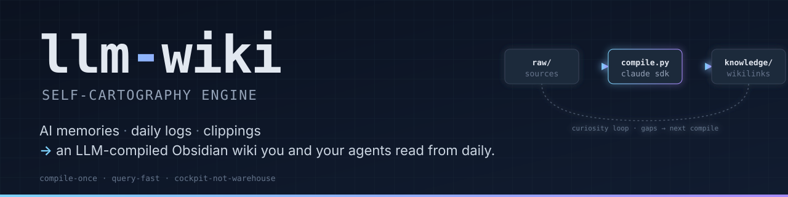

<p align="center">
  
</p>

<p align="center">
  <em>An LLM-compiled wiki for solo knowledge workers — and the AI agents you work with every day.</em>
</p>

<p align="center">
  <a href="./LICENSE"></a>
  
  
  
  
</p>

<table align="center">
  <tr>
    <td align="center"><strong>9</strong><br/>collectors</td>
    <td align="center"><strong>4</strong><br/>agents wired</td>
    <td align="center"><strong>0</strong><br/>vector indexes</td>
    <td align="center"><strong>MIT</strong><br/>open source</td>
  </tr>
</table>

> Yesterday's Claude Code session is already a daily-log entry. This week's screenshots already have a summary article. Open a fresh agent session and the wiki index loads before you type. **You read what the agent wrote. The agent reads what you wrote. Both refine the same surface.**

## What is this

An opinionated **knowledge-compilation engine** for personal substrates. Drop raw materials in — daily session logs, AI-agent memories, web clippings, screenshots, emails, calendars, browser history, HTML files — and a Claude Agent SDK loop compiles them into atomic Markdown articles with wikilinks. Renders as a navigable wiki inside [Obsidian](https://obsidian.md). The same wiki gets injected into every AI-agent session as context, so the loop closes: you read what you wrote, the agent reads what it wrote, both refine the same surface.

The vault holds **data**. The `.wiki/` directory holds the **engine**. They never mix on disk.

## Why it exists

A solo knowledge worker's thinking lives in too many partial substrates: daily notes capture *what happened*, AI-agent memories capture *working thought*, clippings capture *curiosity*, screenshots and calendars capture *everything else*. Each is queryable in isolation, but not as a whole — and most are illegible even to the person who produced them.

Existing tools either solve a slice or solve a different problem:

- **[Karpathy's LLM Wiki](https://gist.github.com/karpathy/442a6bf555914893e9891c11519de94f)** — the `raw/` → `knowledge/` shape and the compile-don't-retrieve choice; a sketch, not a working pipeline.
- **[claude-memory-compiler](https://github.com/coleam00/claude-memory-compiler)** (Cole Medin) — the session-capture pattern; only handles AI-agent memories, doesn't ingest other substrates.
- **Obsidian** — manual curation, no compilation.
- **Notion** — team docs, not personal cartography.
- **RAG systems** — retrieval, not compilation; weak cross-doc reasoning.

llm-wiki is the **compilation layer** between raw substrates and active consumption — by humans reading and by agents prompting. It is not an archive to be left behind; it is a working surface that gets refined by being used.

## What you get

- **Two-path ingest** — automatic session capture (hooks → `daily/`) and curated sources (9 collectors → `raw/`) converge at one compiler.
- **Compile once, query fast** — knowledge is distilled into Markdown wikilinks at compile time. No embedding step, no retrieval per query.
- **Multi-agent hooks** — `session-start` / `session-end` / `pre-compact` wired into Claude Code, Codex, Gemini, and Cursor. Every session ends as a structured daily-log entry.
- **Curiosity loop** — a small local Ollama model spots gaps after each compile and queues deep-scan requests for the next cycle.
- **Optimization suggestions** — the compiler proposes YAML automations (e.g. mail-filter rules) with per-action approval before execution.
- **Self-healing wiki** — `lint.py` runs 6 structural checks plus an LLM contradiction scan, so the wiki stays consistent as it grows.
- **Engine / vault split** — engine code, prompts, hooks, runtime state, and venv all live under `<vault>/.wiki/`. The vault root stays clean.
- **One install, one CLI, one venv** — `wiki setup` + `wiki update` + `wiki status` cover the full lifecycle.


## Two ingest paths converge at compile

```text
PATH A — Automatic capture                PATH B — Curated sources
─────────────────────────────             ──────────────────────────────────
session-start / session-end /             Scanners + manual drops + clipper:
pre-compact hooks attach to every         · scan-email      (Thunderbird)
Claude Code / Codex / Gemini /            · scan-calendar   (Thunderbird CalDAV)
Cursor session.  flush.py extracts        · scan-browser    (Firefox + Chrome)
the conversation transcript and           · scan-screenshots (Vision LLM)
appends a structured entry to             · scan-tabs       (Firefox STG)
daily/YYYY-MM-DD.md.                      · sync-memories   (Claude Code memory)
                                          · clippings-sweep (Obsidian Web Clipper)
                                          · ingest-html     (file or URL)
            │                             · process-inbox   (LLM-classified drop)
            ▼                                          │
     daily/YYYY-MM-DD.md                               ▼
                                          raw/{articles,papers,notes,transcripts,
                                              audio,memories,requests,suggestions}/
            │                                          │
            └──────────────┐    ┌──────────────────────┘
                           ▼    ▼
                  ┌────────────────────┐
                  │     compile.py     │   Claude Agent SDK loop.
                  │                    │   Reads index.md + AGENTS.md (vault),
                  │                    │   walks raw/ + daily/, distils into
                  │                    │   atomic articles + cross-links.
                  └────────────────────┘
                           │
                           ▼
                  ┌────────────────────┐
                  │     knowledge/     │   LLM owns; you and your agents read.
                  │  concepts/         │
                  │  connections/      │   ← cross-source links
                  │  projects/         │
                  │  people/           │
                  │  qa/               │
                  │  index.md          │   ← master catalogue
                  └────────────────────┘
```

After every compile, two side loops run on the new article:

- **Curiosity loop** — a small local Ollama model spots gaps and writes JSON deep-scan requests to `raw/requests/`. The next compile cycle picks one up and fills the gap.
- **Optimization suggestions** — the compiler emits YAML proposals to `raw/suggestions/` for repeatable manual actions (e.g. mail filter rules). `execute-suggestions.py` applies them only after explicit per-action approval.

`lint.py` watches the wiki itself: 6 structural checks (broken links, orphan pages, orphan sources, stale articles, missing backlinks, sparse articles) plus one LLM-driven contradiction scan.

## The defining choice: compile once, query fast

Knowledge is distilled into Markdown wikilinks at compile time — no embedding step, no retrieval at every query.

| Approach | Cost per query | Latency | Cross-doc reasoning |
|---|---|---|---|
| RAG | re-embed + retrieve every time | seconds | weak — chunks are isolated |
| llm-wiki | one-time compile per source | ms — it's already markdown | strong — LLM saw all sources during compile |

**Speed compounds.** Every query is a Markdown read, so the wiki ends up read more often than it's written — by you, and by every agent you give vault access to. That inversion (output → input ratio greater than 1) is the point.

Inspired by [Andrej Karpathy's LLM Wiki](https://gist.github.com/karpathy/442a6bf555914893e9891c11519de94f) (the `raw/` + `knowledge/` shape, the compile-don't-retrieve choice) and [Cole Medin's claude-memory-compiler](https://github.com/coleam00/claude-memory-compiler) (the session-capture pattern). The architecture wrapped around them — collectors, two-path ingest, curiosity loop, suggestions, lint, hooks across multiple agents, the engine/vault split — is the work of this project. Full design rationale in [docs/concept.md](docs/concept.md); hard-won engine learnings (Ollama gotchas, rate-limit debugging, anti-patterns) in [.ytstack/KNOWLEDGE.md](.ytstack/KNOWLEDGE.md).

## Engine vs. vault split

```text
<vault>/
├── AGENTS.md              ← article-schema spec (seeded from templates/, then yours)
├── dashboard.md           ← Dataview home page (seeded from templates/, then yours)
├── raw/                   ← immutable curated sources (LLM reads, never writes)
├── daily/                 ← session transcripts (one file per day, append-only)
├── knowledge/             ← LLM-compiled wiki (LLM owns, you and agents read)
├── inbox/                 ← transient — process-inbox.py classifies + moves to raw/
├── Clippings/             ← optional — Obsidian Web Clipper drop point
├── .obsidian/             ← Obsidian config (community-plugins, core-plugins seeded)
├── .claude/skills/        ← symlinks to .wiki/skills/<name> (auto-discovered)
└── .wiki/                 ← engine — hidden from Obsidian, never modified by hand
    ├── wiki                 (CLI entry, bash)
    ├── install.sh
    ├── lib/*.sh             (UI, agent registry, hook flows, config wrapper)
    ├── scripts/*.py         (compile, flush, lint, query, scan-*, …)
    ├── hooks/*.py           (session-start, session-end, pre-compact, _transcript)
    ├── prompts/*.md         (LLM templates, ${var} substitution)
    ├── templates/           (AGENTS.example.md, dashboard.md, .obsidian/*.json)
    ├── skills/<name>/       (engine-pr, excalidraw-diagram, ingest-audio,
    │                         vault-health-check, vault-triage)
    ├── config.example.yaml  (tracked)  + config.yaml (gitignored)
    ├── pyproject.toml + uv.lock
    └── runtime (gitignored): state/  logs/  sessions/  reports/  .venv/
```

The vault holds the **data**. `.wiki/` holds the **engine**. The two never mix on disk.

## Install

```bash
curl -fsSL https://raw.githubusercontent.com/lx-0/llm-wiki/main/install.sh | bash
# or with explicit target:
curl -fsSL https://raw.githubusercontent.com/lx-0/llm-wiki/main/install.sh | bash -s -- ~/path/to/vault
```

The installer clones into `<target>/.wiki/`, seeds `config.yaml` from `config.example.yaml`, runs `uv sync` so the venv lives at `<target>/.wiki/.venv/`, and seeds the vault root from `.wiki/templates/` — but **only when each target file is absent**, never overwriting existing work.

| Created path | Source | Purpose |
|---|---|---|
| `<vault>/AGENTS.md` | `templates/AGENTS.example.md` | Article-schema spec read by every compile prompt. Edit the *Vault Owner* + *Language* sections. |
| `<vault>/dashboard.md` | `templates/dashboard.md` | Obsidian Dataview home (recently-compiled / wiki stats / recent daily logs). |
| `<vault>/.obsidian/community-plugins.json` | `templates/.obsidian/` | Lists `dataview` + `obsidian-excalidraw-plugin` for first-launch approval. |
| `<vault>/.obsidian/core-plugins.json` | `templates/.obsidian/` | Sensible defaults (daily-notes, properties, graph on; sync/publish off). |
| `<vault>/.claude/skills/<name>` | symlink to `.wiki/skills/<name>` | Claude Code auto-discovers engine skills (`engine-pr`, `excalidraw-diagram`, `ingest-audio`, `vault-health-check`, `vault-triage`). New skills shipped via `wiki update` are picked up automatically. |

**Prerequisites:** `bash` ≥ 4, `git`, `jq`, `uv` (Python package manager). Optional but recommended: a local [Ollama](https://ollama.com) — the curiosity loop, screenshot vision, inbox classification, HTML visual analysis, and per-article review all run on local models. The Claude paths (compile, query, lint contradiction check, flush) work without it.

After install:

```bash
cd ~/path/to/vault
./.wiki/wiki setup        # 5-question wizard: Ollama URL, compile model,
                          #   compile-after hour, procmail execution, local-LLM bundle
./.wiki/wiki status       # config + hook install table + Ollama probe
```

## Update

```bash
./.wiki/wiki update       # pulls latest from main, preserves config.yaml + .venv/
```

## Running scripts manually

The venv lives inside `.wiki/`. Two equivalent invocations:

```bash
# Option A — cd into .wiki first (matches script docstrings)
cd ~/path/to/vault/.wiki
uv run python scripts/compile.py

# Option B — pin --project from any CWD
uv run --project ~/path/to/vault/.wiki python ~/path/to/vault/.wiki/scripts/compile.py
```

Hooks always use Option B (the `--project` flag is hardcoded into the agent config).

## Documentation map

| Doc | What's inside |
|---|---|
| [docs/concept.md](docs/concept.md) | Three-layer architecture, compile-vs-RAG, cognitive-function mapping, curiosity loop |
| [docs/PROCESS.md](docs/PROCESS.md) | Live documentation of every data flow inside the engine — 11 numbered processes (German prose, English diagrams) |
| [docs/naming.md](docs/naming.md) | Naming conventions for raw sources and knowledge articles |
| [docs/architecture.png](docs/architecture.png) | Full Excalidraw render of the cognitive architecture |
| [AGENTS.md](AGENTS.md) | Conventions for AI agents working on **this codebase** (separate from the vault's own AGENTS.md) |
| [.ytstack/PROJECT.md](.ytstack/PROJECT.md) | Project framing, success criteria, current status |
| [.ytstack/DECISIONS.md](.ytstack/DECISIONS.md) | Locked architectural choices |
| [.ytstack/KNOWLEDGE.md](.ytstack/KNOWLEDGE.md) | Hard-won engine learnings (Ollama, rate limits, anti-patterns) |

> **Documentation language.** Most docs are English. **`docs/PROCESS.md` is in German** — pull requests that touch a flow keep the existing prose language; bilingual is fine, and Mermaid labels / table headers in English keep diagrams accessible.

## Security

Secrets-leak prevention runs on two layers:

- **CI** ([.github/workflows/secrets-scan.yml](.github/workflows/secrets-scan.yml)) — gitleaks scans every push + PR + nightly cron. Blocks merge on leaks.
- **Pre-commit** ([.pre-commit-config.yaml](.pre-commit-config.yaml)) — local hooks block leaks before they reach git:

  ```bash
  pip install pre-commit && pre-commit install
  ```

Gitleaks rules + allowlist live in [.gitleaks.toml](.gitleaks.toml). Manual scan: `gitleaks detect --no-banner -v`.

If you find a leak in history, rotate the secret immediately, then file an issue (don't post the leaked value).

---

# CLI Reference

Operational layer for an LLM Wiki vault. The `.wiki/` directory is hidden from Obsidian's file tree by default (Obsidian ignores `.`-prefixed dirs).

## Quick start

```bash
./.wiki/wiki                  # interactive top-level menu
./.wiki/wiki setup            # first-time: config wizard + hooks install
./.wiki/wiki status           # config + hooks + Ollama probe
./.wiki/wiki help             # top-level usage
./.wiki/wiki config --help    # config subcommands
./.wiki/wiki hooks --help     # hooks subcommands
./.wiki/wiki update           # git pull + uv sync, preserves config.yaml
```

## Subcommand cheat sheet

| Command | What it does |
|---|---|
| `wiki` | interactive top-level menu |
| `wiki setup [--help]` | first-time wizard (5 questions) + hook install |
| `wiki status` | config summary, hook install table, Ollama probe |
| `wiki update` | `git pull` engine + `uv sync`; never touches `config.yaml` or `.venv/` content |
| `wiki config` | interactive editor — pick section → key → value |
| `wiki config get KEY` | print one value |
| `wiki config set KEY VALUE` | write back to `config.yaml` |
| `wiki config keys` | list every settable key (dot-notation) |
| `wiki config path` | absolute path to `config.yaml` |
| `wiki config wizard` | re-run the 5-question wizard |
| `wiki config status` | summary table |
| `wiki hooks install` | install into selected agents (claude / codex / gemini / cursor) |
| `wiki hooks uninstall` | remove wiki-managed hooks |
| `wiki hooks status` | install table per agent / scope |

## Setup wizard — what's asked

The 5 questions, in order:

1. **Ollama base URL** — probed live; if unreachable the next question gets a warning.
2. **Compile model** — `claude-opus-4-7` / `claude-sonnet-4-6` / `claude-haiku-4-5`. Used by `compile.py` and `retry-failed-flushes.py`.
3. **Auto-compile starts at hour** (`0`–`23`, local time) — `scheduling.compile_after_hour`.
4. **Procmail execution** (default OFF) — only enable if `execute-suggestions.py` should call a webmail-procmail provider API.
5. **Local-LLM features** (curiosity loop + vision screenshots, bundled) — only offered when Ollama probed successfully.

Re-run anytime via `./.wiki/wiki config wizard`.

## Config keys

All in `.wiki/config.yaml`, dot-notation:

```text
scheduling.compile_after_hour          0–23 (default 18)
scheduling.dedup_window_seconds        seconds (default 60)

models.compile_model                   claude-opus-4-7 | claude-sonnet-4-6 | claude-haiku-4-5
models.ollama_url                      e.g. http://localhost:11434
models.vision_model                    e.g. gemma4:e4b
models.curiosity_model                 e.g. gemma4:e4b
models.classify_model                  e.g. gemma4:e4b

features.curiosity_loop                bool — gap detection after compile
features.vision_screenshots            bool — local vision OCR for screenshots
features.procmail_execution            bool — webmail Procmail API calls (default OFF)
features.clippings_sweep               bool — pre-compile lift of <vault>/Clippings/

limits.compile_max_files               int — per-run cap (rate-limit guard)
limits.compile_max_consecutive_failures int — abort after N back-to-back failures
limits.flush_max_retries               int
limits.flush_retry_delay_seconds       int
limits.screenshot_resize_width         px
limits.screenshot_timeout_seconds      seconds
limits.curiosity_max_gaps              int — max requests per compile
limits.curiosity_min_source_chars      int — skip curiosity for tiny sources
limits.sparse_threshold_words          int — lint warns under this word count

# Recurring tasks spawned at session-end after flush.
piggybacks.email_incremental.{enabled, cooldown_hours}
piggybacks.lint_structural.{enabled, cooldown_hours}
piggybacks.review_wiki.{enabled, cooldown_hours}
piggybacks.optimize_claude_md.{enabled, cooldown_hours}
piggybacks.scan_screenshots.{enabled, cooldown_hours}
piggybacks.follow_requests.{enabled, cooldown_hours, max_per_run}
piggybacks.sync_memories.{enabled, cooldown_hours}
piggybacks.retry_failed_flushes.{enabled, cooldown_hours, max_per_run}

graph_view.mode                        knowledge-only | full-vault | sources-only | custom
graph_view.custom_search               obsidian search string (when mode=custom)

# Per-instance personal data — drives compile prompts, scan-email, scan-calendar,
# thunderbird-rules, execute-suggestions. Lives in config.yaml only (gitignored);
# config.example.yaml ships empty defaults.
personal.primary_account               account-id used as default in prompts + fallback in compile.py
personal.thunderbird_profile           absolute path; empty disables scan-email + thunderbird-rules
personal.stg_backup_dir                Firefox Simple Tab Groups backup dir (drives scan-tabs)
personal.accounts.<id>.email           full address (used in prompts + Webmail login)
personal.accounts.<id>.label           display label for scan-email reports
personal.accounts.<id>.mbox_paths      list of paths under thunderbird_profile (scan-email)
personal.accounts.<id>.filter_paths    list of paths to msgFilterRules.dat (thunderbird-rules)
personal.accounts.<id>.imap_host       IMAP hostname (thunderbird-rules)
personal.accounts.<id>.imap_user_env   env var name for IMAP user
personal.accounts.<id>.imap_pass_env   env var name for IMAP password
personal.accounts.<id>.has_procmail    bool — account exposes Webmail Procmail API
personal.email_folders[]               { path, desc } — drives compile_curiosity prompt + schema enum
personal.project_examples              list[str] — examples in scan_screenshots vision prompt
personal.calendar_work_keywords        list[str] — substrings marking work events in scan-calendar
```

Run `./.wiki/wiki config keys` for the live, full list.

## Hook targets

| Agent | Config file | SessionStart | SessionEnd | PreCompact |
|---|---|---|---|---|
| claude | `.claude/settings.json` | ✓ | ✓ | ✓ |
| codex | `.codex/hooks.json` | ✓ | Stop | — |
| gemini | `.gemini/settings.json` | ✓ | ✓ | PreCompress |
| cursor | `.cursor/hooks.json` | ✓ | ✓ | ✓ |

Install scope:

- **user** (recommended, wizard default) — `~/<.agent>/...` — hooks fire for every agent session regardless of CWD. This is the right scope for llm-wiki's purpose: capture sessions from every project the operator works in, not only sessions launched with CWD = vault root. Generated commands use absolute paths so they resolve correctly from any working directory.
- **project** — `<repo>/<.agent>/...` — hooks fire only when the agent CLI launches with CWD = vault root. Useful if you intentionally want to capture only in-vault work.

Not supported: **pi** (TS-only modules), **opencode** (no native hooks yet, [issue #5409](https://github.com/sst/opencode/issues/5409)).

## Engine layout (`.wiki/`)

```text
.wiki/
├── wiki                       ← entry point — sources lib/*.sh, dispatches subcommands
├── install.sh                 ← one-liner installer (also re-runnable from a checkout)
├── config.example.yaml        ← tracked  ── │ copy at install time
├── config.yaml                ← gitignored ─┘
├── pyproject.toml + uv.lock
├── lib/
│   ├── common.sh              ← paths, colors, logging, deps, backup
│   ├── ui.sh                  ← interactive prompts (confirm / ask / select_one / select_many)
│   ├── agents.sh              ← agent registry, detection, payload generators, install/uninstall
│   ├── hooks.sh               ← interactive flows for `wiki hooks {install,uninstall,status}`
│   └── config.sh              ← Python config CLI wrapper + setup wizard + interactive editor
├── scripts/
│   ├── wiki_config.py         ← config dataclass + get/set/keys CLI (incl. Personal block)
│   ├── config.py              ← path constants (single source of truth for *_DIR)
│   ├── prompts.py             ← prompt template loader (${var} substitution)
│   ├── ollama_client.py       ← single Ollama transport (chat / chat_schema / chat_vision)
│   ├── flush_pipeline.py      ← staged-flush state machine (stage / commit / archive / pending)
│   ├── compile.py             ← Claude Agent SDK compiler (raw/ + daily/ → knowledge/)
│   ├── flush.py               ← session-end → daily/ append + piggyback spawner
│   ├── lint.py                ← 6 structural checks + 1 LLM contradiction check
│   ├── query.py               ← Claude Agent SDK natural-language query (read-only / file-back)
│   ├── scan-email.py          ← Thunderbird mboxes (full / incremental / deep)
│   ├── scan-calendar.py       ← Thunderbird CalDAV cache → timeline overview
│   ├── scan-browser.py        ← Firefox + Chrome bookmarks/history/tab-groups
│   ├── scan-screenshots.py    ← ~/Screenshots/ + Vision LLM (Ollama gemma4)
│   ├── scan-tabs.py           ← Firefox Simple Tab Groups backups
│   ├── sync-memories.py       ← Claude Code project memories → raw/memories/ (file-per-memory)
│   ├── clippings_sweep.py     ← <vault>/Clippings/ → raw/articles/ (pre-compile lift)
│   ├── ingest-html.py         ← HTML file or URL → text + visual (Playwright + Vision LLM)
│   ├── process-inbox.py       ← <vault>/inbox/ → classify + move to raw/ subfolder
│   ├── execute-suggestions.py ← per-action approval for raw/suggestions/*.yaml
│   ├── thunderbird-rules.py   ← parse/list/create/export/execute TB filter rules
│   ├── review-wiki.py         ← per-article quality scoring via local LLM
│   ├── optimize-claude-md.py  ← cross-project pattern → ~/.claude/CLAUDE.md edits
│   ├── retry-failed-flushes.py ← reprocess archived flush contexts
│   ├── seed.py                ← initial bulk import from ~/.claude/projects/*/memory/
│   └── health.py              ← read-only colored ASCII vault dashboard
├── hooks/
│   ├── _transcript.py         ← shared transcript walker + tool summarizer
│   ├── session-start.py       ← inject index.md into next session's context
│   ├── session-end.py         ← spawn flush.py with the conversation transcript
│   └── pre-compact.py         ← safety-net flush before context compaction
├── prompts/                   ← LLM prompts as standalone .md files
├── templates/                 ← seeded into <vault>/ on install (never overwritten)
│   ├── AGENTS.example.md
│   ├── dashboard.md
│   └── .obsidian/{community,core}-plugins.json
├── skills/                    ← engine skills (symlinked into <vault>/.claude/skills/)
│   ├── engine-pr/SKILL.md
│   ├── excalidraw-diagram/SKILL.md
│   ├── ingest-audio/SKILL.md
│   ├── vault-health-check/SKILL.md
│   └── vault-triage/SKILL.md
└── (gitignored runtime)
    ├── .venv/                 ← uv-managed Python environment
    ├── state/                 ← *.json hash trackers, dedup, cooldowns
    ├── logs/                  ← *.log files
    ├── sessions/              ← session-flush staging + failed-flushes/
    └── reports/               ← lint + review-wiki output
```

## Adding a new agent target

1. Add a tuple to `WIKI_AGENTS` in [lib/agents.sh](lib/agents.sh): `name|detection-dir|config-file`.
2. Add a payload generator function `<name>_hooks_payload` that emits JSON for that agent's hook schema.
3. Wire it into `agent_payload()`'s case statement.
4. The status table, install/uninstall flows, and detection logic pick it up automatically.

## Adding a new tunable

1. Extend the matching dataclass in [scripts/wiki_config.py](scripts/wiki_config.py).
2. Document the default in `config.example.yaml` with a comment.
3. Replace the hardcoded constant in the script with `CONFIG.<section>.<field>`.
4. The Python `keys` CLI auto-discovers it; `wiki config get/set` works without further changes.

For per-instance / personal data (emails, hostnames, mbox paths, project names mentioned in prompts), use the `Personal` dataclass — `config.example.yaml` ships empty defaults, the actual value goes in the user's local `config.yaml` (gitignored), and consumers handle the empty case gracefully.

## Adding a prompt

1. Drop `<name>.md` into `prompts/`.
2. Use `${var}` for placeholders (not Python's `{var}` — JSON/YAML examples in prompts have literal braces).
3. `from prompts import render` and `prompt = render("name", var=value)`.

## Why bash + python + jq?

- **bash** for UI and orchestration — selection menus, scope choice, multi-target install.
- **python** for YAML parsing and config invariants — dataclass-backed, type-coerced, validated.
- **jq** for JSON merge of agent configs — preserves the user's existing hooks instead of clobbering them.

No yaml-in-bash, no json-in-python. Each tool does what it's good at.
