# Agentic Brain — Process Flows

Lebende Dokumentation aller Datenflüsse im Agentic Brain. Jeder Process wird beschrieben durch: Mermaid-Diagramm (Übersicht), Prosa (Erklärungen, Kontext, Warum), Tabellen (Konfiguration, Routing), Edge Cases.

> **Konvention für die `uv run …`-Beispiele in diesem Doc:** alle als CWD = `<vault>/.wiki/` gemeint. Der Python-Venv lebt unter `<vault>/.wiki/.venv/` (vom `install.sh` per `uv sync --project <DEST>` erzeugt). Aus jeder anderen Working-Directory entweder `cd <vault>/.wiki` voranstellen oder `--project <vault>/.wiki` als Flag setzen.

Zwei fundamental getrennte Ingest-Pfade konvergieren bei `compile.py`:

- **Path A** — Automatische Session-Capture (Hooks → daily/ → compile)
- **Path B** — Kuratierte Quellen (Scanners/Manual/Inbox → raw/ → compile)

## Übersicht — die 14 Prozesse

| # | Process | Was passiert | Trigger |
|---|---|---|---|
| [1](#1-inbox-processing) | Inbox Processing | Klassifiziert Drops in `inbox/`, verschiebt in `raw/<typ>/` | Manueller Drop |
| [2](#2-automatic-session-capture-hooks) | Automatic Session Capture | Hooks → `daily/YYYY-MM-DD.md` | session-start / session-end / pre-compact |
| [3](#3-compilation) | Compilation | Claude Agent SDK liest `raw/` + `daily/`, schreibt Articles in `knowledge/` | manuell oder cron-after-hour |
| [4](#4-scanners) | Scanners | Email · Calendar · Browser · Screenshots · Tabs → `raw/notes/` | per-Scanner Cron oder piggyback |
| [5](#5-seed-einmalig) | Seed (einmalig) | Bulk-Import aus `~/.claude/projects/*/memory/` | One-shot bei Onboarding |
| [6](#6-query--lint) | Query + Lint | NL-Query gegen Wiki · 6 strukturelle Checks · 1 LLM-Contradiction-Scan | manuell |
| [7](#7-wiki-review-lokal-kostenlos) | Wiki Review | Per-Article Quality-Score via lokales LLM | piggyback |
| [8](#8-curiosity-loop) | Curiosity Loop | Gap-Detection → JSON-Requests in `raw/requests/` | nach jedem Compile |
| [9](#9-optimization-suggestions-email) | Optimization Suggestions | YAML-Proposals (z.B. Mail-Filter) → per-action approval | nach Compile |
| [10](#10-claudemd-optimizer) | CLAUDE.md Optimizer | Cross-Project-Pattern → `~/.claude/CLAUDE.md` Edits | piggyback |
| [11](#11-screenshot-scanner) | Screenshot Scanner | `~/Screenshots/` → Vision-LLM → `raw/notes/` | piggyback (lokal-only) |
| [12](#12-vault-ux-layer-dashboard--mocs) | Vault UX Layer | Dashboard.md (Auto-Open) + `_dashboard-stats.md` Refresh + MOCs (in Arbeit) | nach jedem Flush (synchron) |
| [13](#13-hard-facts-corrections) | Hard Facts (Corrections) | `wiki correct` schreibt `knowledge/facts/<slug>.md` → injected in compile/query/lint; `apply` propagiert agentisch über `knowledge/`+`daily/` | manuell (`wiki correct add` / `wiki correct apply`) |
| [14](#14-agent-tasks) | Agent Tasks | `prompts/agent_<id>.md` declares Claude Agent SDK config (model + tools + permission + button) per task. `wiki agent <id>` runs it. Dashboard buttons auto-wired via `wiki seed`. | manuell oder per Dashboard-Button |

---

## 1. Inbox Processing

Drop eine Datei in `inbox/`. Das System erkennt den Typ, konvertiert wenn nötig, **verschiebt** in den richtigen `raw/` Unterordner, und triggert Compilation.

> **inbox/ vs raw/:** `inbox/` lebt auf Root-Level, **nicht** innerhalb von `raw/`. Denn `raw/` ist immutabel (Karpathy-Prinzip: Ground Truth, never modify). `inbox/` ist transient — Dateien werden klassifiziert und nach `raw/articles/`, `raw/notes/`, etc. verschoben. Die Inbox leert sich, die Sources leben permanent in `raw/` weiter.

### Flow

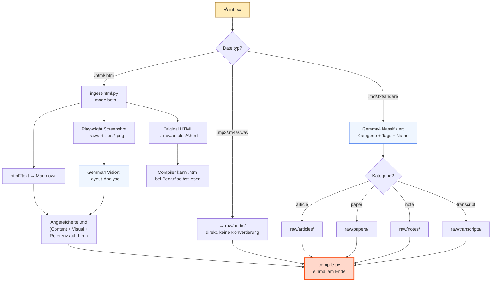

### Routing-Tabelle

| Extension | Route | Script | LLM? | Warum |
|-----------|-------|--------|------|-------|
| `.html`, `.htm` | `raw/articles/` (.html + .md + .png) | `ingest-html.py` | Gemma4 Vision | Original HTML bewahrt + Content-Extraktion + Visual Analysis. Compiler entscheidet selbst ob er .html liest. |
| `.mp3`, `.m4a`, `.wav`, `.ogg`, `.webm` | `raw/audio/` | — | Nein | Binaries werden direkt verschoben. Whisper-Transkription ist ein separater Schritt. |
| `.pdf` | `raw/papers/` | — | Nein | Extension-basiert. PDF-Text-Extraktion noch nicht implementiert. |
| `.md`, `.txt` | je nach Klassifizierung | — | Gemma4 | LLM liest Content, klassifiziert als article/paper/note/transcript, schlägt Dateiname und Tags vor. |
| andere | `raw/notes/` | — | Gemma4 | Fallback: alles Unbekannte wird als Note behandelt. |

### Details

**HTML-Ingest (--mode both):** Drei Outputs pro HTML-Datei:

1. **Original HTML** → `raw/articles/slug.html` (unverändert, als Ground Truth)
2. **Angereicherte Markdown** → `raw/articles/slug.md` (Content-Extraktion via html2text + Visual Analysis via Gemma4 + Referenz auf die .html)
3. **Screenshot** → `raw/articles/slug.png` (Full-Page via Playwright)

Der Compiler liest die `.md` (Anreicherung) und kann bei Bedarf die `.html` (Original) selbst mit dem Read-Tool öffnen — er entscheidet autonom ob der extrahierte Content ausreicht oder ob er die volle HTML braucht.

**LLM-Klassifizierung:** Gemma4 bekommt Dateiname + die ersten 2000 Zeichen Content. Antwortet mit JSON: `{category, suggested_name, tags, language, summary}`. Bei Fehler: Fallback auf "note".

**Frontmatter:** Textdateien bekommen automatisch YAML Frontmatter (type, date, origin, tags, language) bevor sie in `raw/` landen.

**Compile:** Am Ende ruft `process-inbox.py` einmal `compile.py` auf — nicht pro Datei, sondern einmal für alles Neue.

### Script

```bash
uv run python scripts/process-inbox.py                    # alles verarbeiten + compile
uv run python scripts/process-inbox.py --dry-run          # nur zeigen was passiert
uv run python scripts/process-inbox.py --no-compile       # verarbeiten ohne compile
uv run python scripts/process-inbox.py --model gemma3:4b  # anderes Modell
```

### Edge Cases

- **Datei existiert schon:** Timestamp wird an den Dateinamen angehängt (`slug-2026-04-13.md`).
- **LLM nicht erreichbar:** Fallback auf Kategorie "note" und Dateiname aus Original-Stem.
- **Leere Inbox:** Script exited sauber, kein Compile getriggert.
- **HTML ohne Titel:** Slug wird aus Dateiname generiert.

---

## 2. Automatic Session Capture (Hooks)

Jede Claude Code Session — egal in welchem Projekt — wird automatisch captured und zu Wissen kompiliert. Der Mensch muss nichts tun.

### Flow

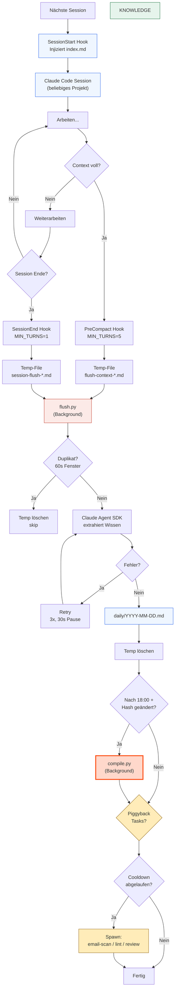

### Hooks

| Hook | Trigger | Threshold | Temp-File Prefix | Timeout |
|------|---------|-----------|------------------|---------|
| SessionStart | Session öffnet sich | — | — | 15s |
| PreCompact | Context Window voll | MIN_TURNS=5 | `flush-context-` | 10s |
| SessionEnd | Session endet | MIN_TURNS=1 | `session-flush-` | 10s |

### Details

**Hooks sind global** konfiguriert (`~/.claude/settings.json`), nicht projekt-lokal. Jede Claude Code Session wird captured — egal in welchem Projekt der Operator gerade arbeitet.

**SessionStart** injiziert `index.md` (Master-Katalog aller Wiki-Artikel) + die letzten 30 Zeilen des heutigen `daily/` Logs. Max 20K Zeichen. Keine API-Calls, reines File-I/O, <1 Sekunde.

**SessionEnd/PreCompact** lesen das JSONL-Transcript, extrahieren die letzten 30 Turns (max 15K Zeichen), staging das Temp-File via `flush_pipeline.stage(kind, session_id, content)`, und spawnen `flush.py` als detached Background-Prozess. Beide Hooks teilen `hooks/_transcript.py` für Transcript-Walk + Tool-Summarization (Edit/Write/Bash/Read mit Detail) — pre-compact hatte historisch eine lossy Variante (`[tool: X]` / `[tool result]`), das ist jetzt eliminiert.

**flush.py** nutzt den Claude Agent SDK mit `allowed_tools=[]` (nur Text rein/raus, keine Dateioperationen). Extrahiert: Context, Key Exchanges, Decisions, Lessons Learned, Action Items. Bei Erfolg → `flush_pipeline.append_to_daily(content, session_id)` + `mark_complete(staged)`. Bei Failure → `flush_pipeline.archive_failure(staged)` (nach `.wiki/sessions/failed-flushes/`); ein Piggyback-Task retried das später.

**State-Machine in einem Modul.** Die ganze Lifecycle (Capture → Stage → Commit / Archive → Retry) lebt in `scripts/flush_pipeline.py`. Hooks, `flush.py` und `retry-failed-flushes.py` gehen alle durch dieselbe API. Die Invariante "no gap between capture and persist" hat damit ein Code-Home, nicht nur Prosa in `.ytstack/KNOWLEDGE.md`.

**Recursion Guard:** Alle Agent SDK Scripts (flush, compile, query, lint) setzen `CLAUDE_INVOKED_BY` env var. Die Hooks prüfen diese Variable und exiten sofort wenn gesetzt. Verhindert dass Hooks auf ihre eigenen Sessions feuern.

**Auto-Compile:** Nach 18:00 prüft flush.py ob der daily log sich seit dem letzten Compile geändert hat (SHA-256 Hash-Vergleich gegen state.json). Nur wenn ja, wird compile.py als Background-Prozess gespawnt.

**Retry bei Rate Limits:** 3 Versuche mit 30 Sekunden Pause. Nach 3 Fehlern: Temp-File wird trotzdem gelöscht, Warning geloggt.

**Piggyback-Scheduler:** Nach erfolgreichem Flush (und ggf. Compile) prüft `flush.py` ob konfigurierte Hintergrund-Tasks gestartet werden sollen. Bedingungen: nach 18:00 UND konfigurierbarer Cooldown abgelaufen. State in `.wiki/state/piggyback-state.json`. Task-Liste lebt in `flush.py:_PIGGYBACK_COMMANDS`; pro Task ist `enabled` und `cooldown_hours` über `CONFIG.piggybacks.<name>` einstellbar.

| Task | Script | Cooldown | Kosten |
|------|--------|----------|--------|
| Email Incremental Scan | `scan-email.py --incremental` | 24h | $0 (lokal) |
| Curiosity Loop Requests | `scan-email.py --follow-requests` | 24h | $0 (Ollama/Gemma4) |
| Screenshot Scan | `scan-screenshots.py --all --limit N` | 24h | $0 (Ollama/Gemma4) |
| Structural Lint | `lint.py --structural-only` | 24h | $0 (kein LLM) |
| Wiki Review | `review-wiki.py` | 168h (1x/Woche) | $0 (Ollama/Gemma4) |
| CLAUDE.md Optimizer | `optimize-claude-md.py` | 24h | $ (Claude API) |
| Memory Sync | `sync-memories.py` | 24h | $0 (kein LLM) |
| Retry Failed Flushes | `retry-failed-flushes.py --limit N` | 24h | $ (Claude API) |
| Dashboard Stats Refresh | `dashboard_stats.py` (synchron, kein Piggyback) | nach jedem Flush | $0 (kein LLM) |

Tasks werden als detached Background-Prozesse gespawnt (gleiche Mechanik wie compile.py). Sie laufen unabhängig voneinander und vom Compile. Der Piggyback läuft nur nach erfolgreichem Flush — bei Dedup, Empty oder Fail wird er übersprungen.

`retry-failed-flushes` greift sich Files aus `.wiki/sessions/failed-flushes/` (über `flush_pipeline.pending(limit=N)`), retried die Extraction, schreibt bei Erfolg ins daily Log + cleared das Staging-File. So gibt's keine Lücke in der Capture→Persist-Kette.

### Edge Cases

- **Sehr kurze Sessions** (<1 Turn für SessionEnd, <5 für PreCompact): Werden übersprungen.
- **Compile.py Sessions:** Werden nicht captured dank CLAUDE_INVOKED_BY.
- **Rate Limits:** Retry-Logik mit exponentieller Pause.
- **Duplikate:** Wenn SessionEnd und PreCompact innerhalb von 60s für dieselbe Session feuern, wird nur einmal geflusht.
- **Leeres Transcript:** Temp-File wird gelöscht, kein Flush.
- **Piggyback Cooldown:** Mehrere Sessions in schneller Folge → Tasks laufen nur beim ersten Mal, danach Cooldown-Skip.
- **Piggyback Script fehlt:** FileNotFoundError wird geloggt, Task übersprungen, andere Tasks laufen weiter.
- **Piggyback crasht:** Status "error" in State-File, nächster Cooldown-Ablauf versucht erneut.

---

## 3. Compilation

Der Kern des Systems. Nimmt rohe Quellen (daily/ + raw/) und kompiliert sie zu vernetzten Wiki-Artikeln. 1 Source → 5-15 Artikel updated.

### Flow

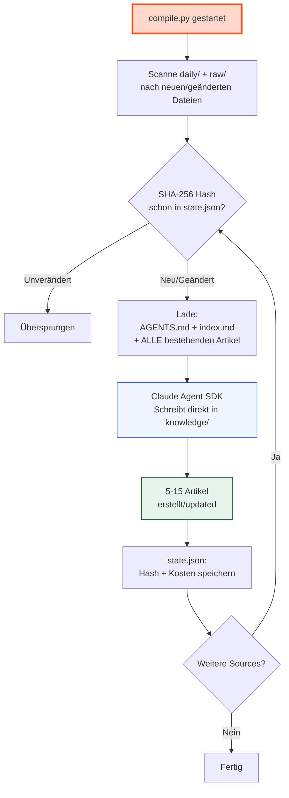

### Details

**Input:** AGENTS.md (Schema) + index.md (Katalog) + die neue Source. Der Compiler bekommt `Read`/`Grep`/`Glob` Tools und holt sich Detailartikel on-demand statt das ganze Wiki in den Prompt zu laden — das war der ursprüngliche Ansatz, hat aber TPM-Limits getriggert (siehe `.ytstack/KNOWLEDGE.md` "Compile prompt design"). Index-guided Retrieval funktioniert besser als RAG bei <500 Artikeln.

**Agent SDK Config:** `allowed_tools=["Read", "Write", "Edit", "Glob", "Grep"]`, `permission_mode="acceptEdits"`, `max_turns=30`, `system_prompt=claude_code`. Der LLM hat volle Dateioperations-Rechte innerhalb von `knowledge/`.

**Was der Compiler macht pro Source:**

1. Liest die Source komplett
2. Identifiziert 3-7 Concepts
3. Für jedes Concept: existierender Artikel? → Update. Neu? → Create.
4. Erkennt Cross-Cutting Connections → `connections/` Artikel
5. Personen erwähnt? → `people/` Artikel
6. Projekt diskutiert? → `projects/` Artikel
7. Updated `index.md` mit neuen/geänderten Einträgen
8. Appended an `log.md`

**Kosten:** ~$0.02-0.15 pro Source (abhängig von Größe und Anzahl bestehender Artikel). 1 Source updated typisch 5-15 Artikel, was den Per-Source-Preis vs. Per-Artikel-Wert sehr günstig macht.

**Inkrementell:** Nur Sources deren SHA-256 Hash sich seit dem letzten Compile geändert hat werden verarbeitet. `.wiki/state/state.json` trackt Hashes, Timestamps und Kosten pro Datei.

### Script

```bash
uv run python scripts/compile.py                    # nur neue/geänderte
uv run python scripts/compile.py --all              # alles neu kompilieren
uv run python scripts/compile.py --file daily/X.md  # einzelne Datei
uv run python scripts/compile.py --dry-run          # nur zeigen was kompiliert würde
```

### Edge Cases

- **Sehr große Source** (>100K Zeichen): Könnte Context Window Limits treffen. Compile nimmt trotzdem die ganze Datei.
- **Parallele Compiles:** Wenn flush.py und manueller Compile gleichzeitig laufen, könnte es zu Konflikten kommen. Git merge handled Markdown gut; lint findet Inkonsistenzen.
- **Compile crasht:** state.json wird erst nach erfolgreichem Compile updated → nächster Lauf verarbeitet die Source erneut.

---

## 4. Scanners

Scanners extrahieren Metadaten aus lokalen Anwendungen. Nur Headers/Metadaten, keine Inhalte. Produzieren Überblicks-Dateien in `raw/notes/{type}/` die dann durch compile.py laufen.

### Flow

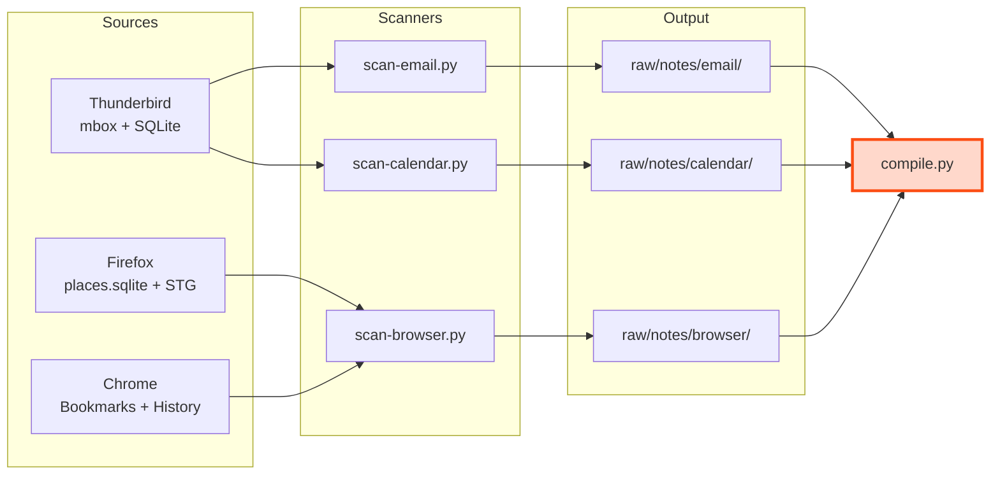

### Scanner-Tabelle

| Scanner | Quelle | Daten | Output |
|---------|--------|-------|--------|
| `scan-email.py` | Thunderbird mbox (lokal) | tausende Mails über mehrere Accounts/Ordner. | `raw/notes/email/` |
| `scan-calendar.py` | Thunderbird calendar SQLite | hunderte bis tausende Events, Attendees, Kategorien. | `raw/notes/calendar/` |
| `scan-browser.py` | Firefox places.sqlite + STG + Chrome | tausende Tabs, Bookmarks, zehntausende Visits. | `raw/notes/browser/` |

### Email Scanner — Drei Modi

**Full Scan** (default): Metadata-Überblick aller Accounts/Ordner. Nur Headers (From/To/Subject/Date). Output: `thunderbird-overview-YYYY-MM-DD.md`. Speichert Dateigröße pro mbox in `email-state.json`.

**Incremental** (`--incremental`): Prüft mbox-Dateigröße gegen `email-state.json`. Nur Ordner die gewachsen sind werden gescannt. Output: `delta-YYYY-MM-DD.md` — nur neue/geänderte Ordner. Für tägliche Routine geeignet (Sekunden, kostenlos).

**Deep Scan** (`--deep --folder X`): Liest Mail-Bodies, rekonstruiert Threads (via Message-ID/In-Reply-To/References), optional LLM-Filterung (Gemma4 bewertet Relevanz). Output: `deep-{folder}-YYYY-MM-DD.md` mit Thread-Zusammenfassungen. Folder-Filter ist rekursiv — `--folder "COMPANY"` findet auch alle verschachtelten Unterordner.

**Follow Requests** (`--follow-requests`): Liest einen pending Request aus `raw/requests/*.json` (Typ `email-deep-scan`), führt Deep-Scan für den angegebenen Ordner aus, markiert Request als done. Für den Curiosity Loop.

### Andere Scanner

**Calendar:** Thunderbird SQLite. Feiertage gefiltert. Events + Attendees + Kategorien. Work-Keywords (Customer-/Partner-Namen für die `Kunden / Workshops`-Kategorie) kommen aus `CONFIG.personal.calendar_work_keywords`.

**Browser:** Firefox places.sqlite + STG Backup + Chrome. Tabs, Bookmarks, History, Search History.

**Thunderbird mbox:** Python's `mailbox` Modul liest mbox-Dateien direkt. Kein Thunderbird nötig, kein IMAP. Robustes Error-Handling für kaputte Mails.

**Account-Konfiguration ist gitignored.** scan-email/calendar/thunderbird-rules lesen Account-Map (id → email, label, mbox-paths, IMAP-host, env-var-namen) zur Laufzeit aus `CONFIG.personal.accounts`. Defaults in `config.example.yaml` sind leer; per-install Werte leben in `config.yaml` (gitignored). Pfad zum Thunderbird-Profil: `CONFIG.personal.thunderbird_profile` (leer = Scanner deaktiviert).

**Ollama-Aufrufe** (LLM-Filterung im Deep-Scan, JSON-Klassifizierung, Vision in Screenshots) gehen alle durch `scripts/ollama_client.py` — die Gotchas (Markdown-Fence-Stripping, `format`-Schema mit `enum` für non-empty Strings, `/api/chat` für Vision) leben dort, nicht in jedem Caller.

### Script

```bash
# Email — Full Scan
uv run python scripts/scan-email.py
uv run python scripts/scan-email.py --account <id>          # restrict to one account from CONFIG.personal.accounts
uv run python scripts/scan-email.py --dry-run

# Email — Incremental (nur Deltas)
uv run python scripts/scan-email.py --incremental

# Email — Deep Scan (Bodies lesen)
uv run python scripts/scan-email.py --deep --folder "INBOX/<folder>" --limit 10
uv run python scripts/scan-email.py --deep --folder "INBOX/<folder>" --model gemma4:e4b

# Email — Curiosity Loop Request verarbeiten
uv run python scripts/scan-email.py --follow-requests

# Calendar
uv run python scripts/scan-calendar.py
uv run python scripts/scan-calendar.py --year 2025

# Browser
uv run python scripts/scan-browser.py
uv run python scripts/scan-browser.py --source firefox
```

### Edge Cases

- **Erster Incremental-Lauf:** Alle Ordner sind "changed" (kein vorheriger State). Danach nur echte Deltas.
- **mbox geschrumpft:** Thunderbird hat komprimiert → wird als Changed erkannt, Full Rescan des Ordners.
- **Deep Scan auf großen Ordner:** `--limit` Flag begrenzt Threads pro Lauf.
- **LLM nicht erreichbar:** Deep Scan läuft ohne Filterung weiter (alle Threads behalten).
- **Chrome DB gelockt:** Muss kopiert werden. Fehler wenn Chrome läuft.

---

## 5. Seed (Einmalig)

Einmaliges Bootstrapping: sammelt alle Claude Code Memory-Dateien aus allen Projekten und kompiliert sie ins Wiki.

### Flow

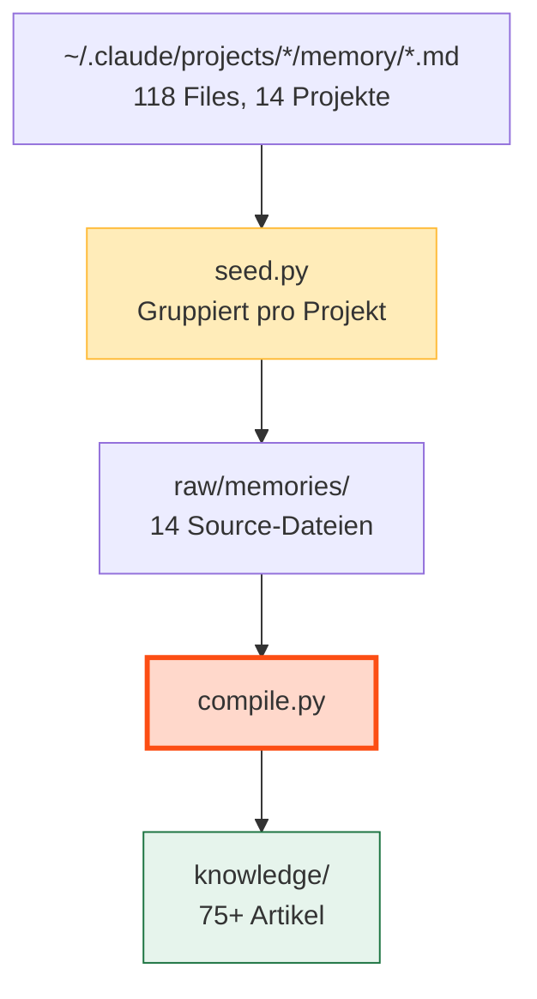

### Details

Memories sind schon destilliertes Wissen — Decisions, Lessons, Feedback, Projekt-Kontext. Sie überlappen teilweise mit Session-Captures (da Memories aus Sessions entstehen), aber der Compiler deduped natürlich.

Nach dem Seed übernehmen die globalen Hooks. Neue Memories entstehen aus Sessions, und die Sessions werden direkt captured. Das Seed-Script muss nur einmal laufen.

### Script

```bash
uv run python scripts/seed.py                    # sammeln + kompilieren
uv run python scripts/seed.py --dry-run          # nur zeigen was gesammelt würde
uv run python scripts/seed.py --no-compile       # sammeln ohne compile
```

---

## 6. Query + Lint

### Query

Frage ans Wiki stellen. Der LLM liest den Index, wählt relevante Artikel, synthetisiert eine Antwort. Mit `--file-back` wird die Antwort als QA-Artikel gespeichert — Knowledge compounds durch Fragen.

```bash
uv run python scripts/query.py "Was weiß ich über Agent Memory?"
uv run python scripts/query.py "Wie funktioniert der Compile-Prozess?" --file-back
```

### Lint

7-Punkt Health Check mit Severity Levels (error/warning/suggestion) und Auto-Fixable Flags.

| Check | Severity | Auto-fixable | Was |
|-------|----------|--------------|-----|
| Broken Links | error | nein | `[[wikilinks]]` zu nicht-existenten Artikeln |
| Orphan Pages | warning | nein | Artikel ohne eingehende Links |
| Orphan Sources | warning | nein | Sources in daily/raw/ die nie kompiliert wurden |
| Stale Articles | warning | nein | Source hat sich seit letztem Compile geändert |
| Missing Backlinks | suggestion | ja | A → B aber B → A fehlt |
| Sparse Articles | suggestion | nein | Unter 200 Wörter |
| Facts Violations | warning | nein | Artikel enthält `negation_terms` aus einem Hard Fact (siehe §13) |
| Contradictions | warning | nein | Widersprüche zwischen Artikeln (LLM-Check) |

```bash
uv run python scripts/lint.py                        # alle 7 Checks
uv run python scripts/lint.py --structural-only      # ohne LLM (kostenlos)
```

---

## 7. Wiki Review (Lokal, Kostenlos)

Gemma4 auf dem lokalen GPU-Server bewertet alle Wiki-Artikel nach 5 Kriterien und gibt Verdicts.

| Kriterium | Was |
|-----------|-----|
| Accuracy | Sind Claims gut belegt? |
| Depth | Substanziell oder oberflächlich? |
| Connections | Sinnvoll mit anderen Konzepten verlinkt? |
| Actionability | Kann man darauf handeln? |
| Freshness | Aktuell oder potenziell veraltet? |

Verdicts: `keep` (gut genug), `enrich` (braucht mehr Tiefe), `merge` (mit anderem Artikel zusammenführen), `archive` (entfernen).

```bash
uv run python scripts/review-wiki.py                    # alle Artikel
uv run python scripts/review-wiki.py --model gemma3:4b  # schnelleres Modell
uv run python scripts/review-wiki.py --limit 10         # nur 10 Artikel
```

Report in `.wiki/reports/wiki-review-YYYY-MM-DD.md`.

---

## 8. Curiosity Loop

Nach jeder Compilation analysiert der Compiler die Source + den Wiki-Index auf Wissenslücken und generiert automatisch Deep-Scan-Requests. Diese werden täglich als Piggyback abgearbeitet.

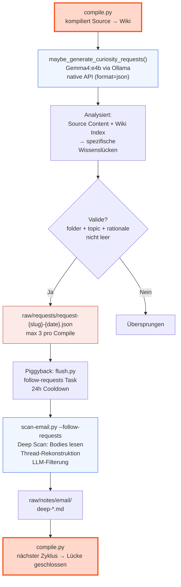

### Details

**Trigger:** `maybe_generate_curiosity_requests()` läuft nach jedem erfolgreichen Compile. Nur für Sources >500 Zeichen.

**LLM:** Gemma4:e4b auf dem lokalen GPU-Server via `ollama_client.chat_schema(prompt, model, schema=...)` — nutzt Ollama native API (`/api/chat`) mit vollem JSON-Schema (constrained decoding). Schema's `folder`-Enum + `account`-Enum werden zur Laufzeit aus `CONFIG.personal.email_folders` und `CONFIG.personal.accounts.keys()` gebaut — single source of truth mit dem Curiosity-Prompt, der dieselbe Folder-Liste rendered. Kein Drift möglich. ~5s pro Request, keine Kosten.

**Limits:** Max 3 Requests pro Compile-Lauf. Requests mit leerem folder/topic/rationale werden verworfen.

**Request-Format:**

```json
{
  "type": "email-deep-scan",
  "status": "pending",
  "folder": "INBOX/<folder-from-personal.email_folders>",
  "account": "<id-from-personal.accounts>",
  "model": "gemma4:e4b",
  "topic": "<specific topic — e.g. ProjectName decisions>",
  "rationale": "<why this folder likely has the answer>"
}
```

Dateiname: `raw/requests/request-{slug}-{date}.json`

**Piggyback:** `follow-requests` Task in flush.py (24h Cooldown). `scan-email.py --follow-requests` nimmt den ältesten pending Request, führt Deep Scan für den angegebenen Ordner aus, markiert Request als done. Deep Scan liest Mail-Bodies, rekonstruiert Threads, filtert via LLM. Output: `raw/notes/email/deep-*.md` — wird beim nächsten Compile verarbeitet.

### Edge Cases

- **LLM nicht erreichbar:** Curiosity-Requests werden übersprungen, Compile läuft normal weiter.
- **Nur kurze Sources:** Sources <500 Zeichen generieren keine Requests.
- **Doppelte Requests:** Gleicher Ordner + Thema kann theoretisch mehrfach requested werden. Der Deep-Scanner liefert trotzdem neue Daten (neue Mails seit letztem Scan).
- **Request ohne passenden Scanner:** Aktuell nur `email-deep-scan` implementiert. Andere Typen bleiben pending.
- **Schema-Bypass durch Modell:** Wenn Ollama trotz constrained decoding `gaps` als Liste von Strings statt Objekten zurückgibt, werden Nicht-Dict-Items mit `WARNING` (samt Sample) verworfen statt die Pipeline abzureißen. Vollständiges Log: `<vault>/.wiki/logs/compile.log`. Nur WARNINGs + ERRORs (für schnelle Triage): `<vault>/.wiki/logs/compile-errors.log`.

---

## 9. Optimization Suggestions (Email)

Der Compiler erkennt Optimierungspotential in Email-Scanner-Daten und schlägt Aktionen vor. Der Mensch reviewed per-Action, ein Script führt aus. Regeln werden serverseitig erstellt (Procmail für Accounts mit `has_procmail: true`, Gmail API für Gmail).

### Flow

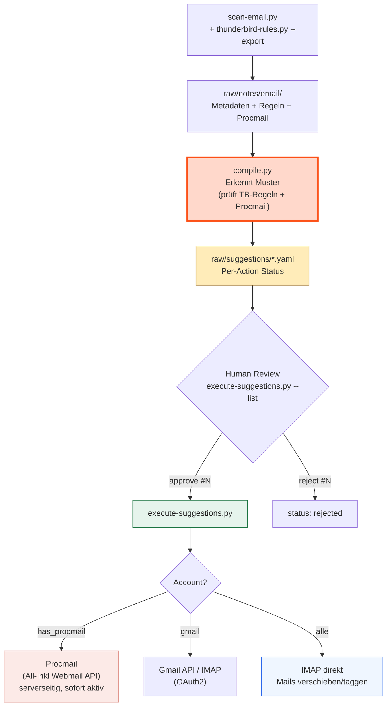

### Drei Execution-Pfade

| Account | Regeln (zukünftige Mails) | Mails (bestehende) |
|---------|--------------------------|---------------------|
| **`has_procmail: true`** (z.B. All-Inkl) | Procmail via Webmail API (serverseitig, sofort aktiv) | IMAP direkt |
| **gmail-*** | Gmail API Filter (OAuth2) | IMAP via OAuth2 |
| **Fallback** | `msgFilterRules.dat` (TB muss zu sein) | IMAP direkt |

### Per-Action Approval

Jede Action innerhalb einer Suggestion hat ein eigenes `status` Feld. Der User approved jede Action einzeln.

### Suggestion-Typen

| Suggestion | Beispiel | Action Type |
|---|---|---|
| Neue Regel erstellen | "CCC → Newsletter: privat" | `create-rule` → Procmail oder Gmail Filter |
| Bestehende Regel erweitern | "Disney+ zu Newsletter: privat hinzufügen" | `extend-rule` |
| Mails verschieben | "710 CCC-Mails → 90 Newsletter" | `imap-move` |
| Mails taggen | "Invoice-Mails → Tag 'Work'" | `imap-tag` |
| Mails als gelesen/geflaggt | "201 Newsletter → read" | `imap-set-flags` |

### Duplikat-Erkennung

Der Compiler prüft VOR dem Generieren: Thunderbird-Regeln + Procmail-Config. Wenn ein Sender bereits abgedeckt ist, wird keine Suggestion generiert. Safety-Net in `execute-suggestions.py` blockt Duplikate bei Execution.

### Procmail (All-Inkl Webmail API)

Für Accounts mit `has_procmail: true` (z.B. den All-Inkl-Account) werden Regeln serverseitig als Procmail geschrieben — über die All-Inkl Webmail API (reverse-engineered, Mailbox-Credentials kommen aus `CONFIG.personal.accounts.<id>.imap_user_env` / `imap_pass_env`). Kein Thunderbird-Restart nötig. `thunderbird_rules.has_procmail_support(account_id)` ist die config-getriebene Routing-Logik.

Syntax: `:0 w` + `* ^From:.*pattern` + `| $DELIVER -m "INBOX/folder"`. Folder-Separator `/`. Backup vor jedem Save in `raw/notes/email/procmail-backup-*.txt`.

### Scripts

```bash
# Thunderbird-Regeln anzeigen
uv run python scripts/thunderbird-rules.py --list --account <id>

# Regeln exportieren (Input für Compiler)
uv run python scripts/thunderbird-rules.py --export

# Suggestions reviewen (per-Action)
uv run python scripts/execute-suggestions.py --list
uv run python scripts/execute-suggestions.py --approve <suggestion-id> 1
uv run python scripts/execute-suggestions.py --reject <suggestion-id> 2
uv run python scripts/execute-suggestions.py --review <suggestion-id>
uv run python scripts/execute-suggestions.py --dry-run
uv run python scripts/execute-suggestions.py
```

### Edge Cases

- **Procmail Folder-Separator:** Muss `/` sein (nicht `.`). z.B. `INBOX/Work/Newsletters`.
- **Duplikat-Sender:** Compiler prüft Procmail + TB-Regeln. execute-suggestions.py blockt als Safety-Net.
- **Merge statt neue Regel:** Compiler bevorzugt Erweiterung bestehender Gruppen.
- **Procmail Backup:** Vor jedem Save in `raw/notes/email/procmail-backup-*.txt`.
- **Gmail OAuth2:** Browser öffnet sich einmalig für Autorisierung. Token persistent.
- **Per-Action Status:** Jede Action wird einzeln approved/rejected/executed.
- **IMAP Credentials fehlen:** Graceful exit mit Hinweis auf `.claude/.env`.

---

## 10. CLAUDE.md Optimizer

Hält `~/.claude/CLAUDE.md` automatisch aktuell basierend auf Wiki-Wissen. Erkennt Cross-Project Patterns und aktualisiert die globale Config direkt. Läuft täglich als Piggyback.

### Flow

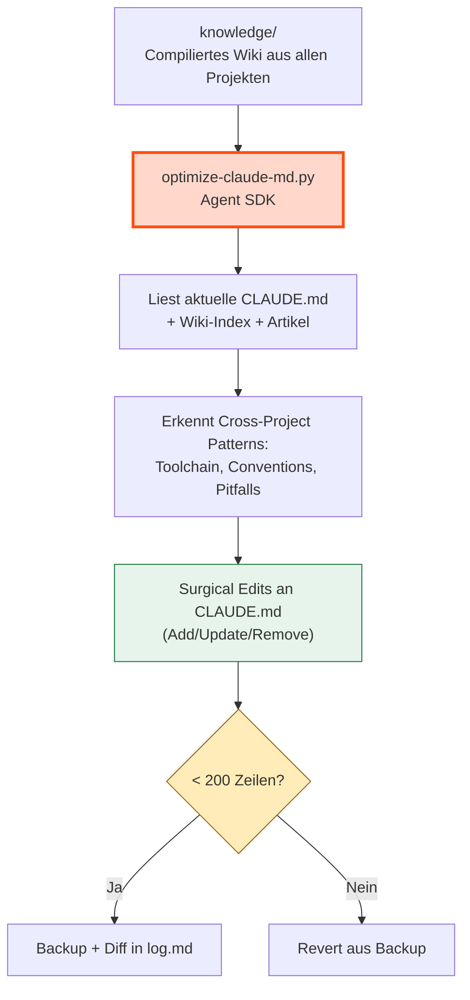

### Details

**Kein Approval nötig** — der Optimizer schreibt direkt. Sicherheit durch:

- Backup vor jedem Write (`raw/notes/claude-md-backups/`)
- 200-Zeilen Hard-Limit (Revert bei Überschreitung)
- Diff wird in `knowledge/log.md` geloggt
- CLAUDE_INVOKED_BY verhindert Recursion
- "Härteste Regel" und "Architektur-Grenzen" werden nie verändert

**Was reingehört:** Tech Stack, Coding Conventions, Build Commands, wiederkehrende Fehler, Workflow-Präferenzen — alles was projektübergreifend gilt.

**Was NICHT reingehört:** Projekt-spezifische Details, temporäre Workarounds, Personen-Details.

### Script

```bash
uv run python scripts/optimize-claude-md.py              # optimize
uv run python scripts/optimize-claude-md.py --dry-run    # nur zeigen
```

Läuft als Piggyback in flush.py (24h Cooldown, nach 18:00).

---

## 11. Screenshot Scanner

Scannt `~/Screenshots/` nach neuen PNG-Screenshots, beschreibt sie via lokalem Vision-LLM (Gemma4), und erstellt Sidecar-Dateien mit YAML-Frontmatter. Sidecar-Dateien bleiben neben den PNGs — das ist die Organisation.

### Flow

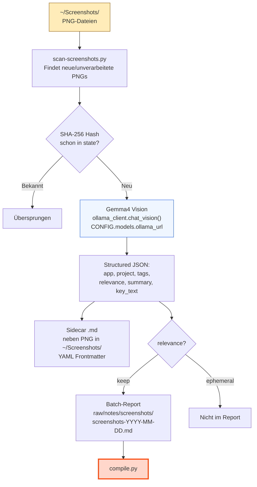

### Details

**Vision-Modell:** Gemma4:e4b auf dem lokalen GPU-Server (Ollama API, Adresse aus `CONFIG.models.ollama_url`). Aufruf via `ollama_client.chat_vision(prompt, model, image_b64)`. Kostenlos, keine API-Kosten. Gibt strukturiertes JSON zurück: `app`, `project`, `tags`, `relevance` (keep/ephemeral), `summary`, `key_text`. Beispiel-`project`-Werte rendert der Prompt aus `CONFIG.personal.project_examples`.

**Sidecar-Dateien:** Pro Screenshot wird eine `.md`-Datei mit YAML-Frontmatter direkt neben dem PNG in `~/Screenshots/` erstellt (z.B. `screenshot-2026-04-15.png` → `screenshot-2026-04-15.md`). Enthält app, project, tags, relevance, summary, key_text. Keine Kategorie-Ordner — die Sidecar-Dateien neben den PNGs sind die Organisation.

**Batch-Reports:** Nur Screenshots mit `relevance: keep` werden in den Tages-Report aufgenommen (`raw/notes/screenshots/screenshots-YYYY-MM-DD.md`). Ephemeral Screenshots werden übersprungen. Der Compiler verarbeitet den Report zu Wiki-Artikeln.

**Piggyback:** Läuft als täglicher Piggyback-Task (nach 18:00, 24h Cooldown) — gleiche Mechanik wie Email-Scan und Lint.

**State-Tracking:** Verarbeitete Screenshots werden per SHA-256 Hash in State-File getrackt. Bereits beschriebene Screenshots werden übersprungen.

### Script

```bash
uv run python scripts/scan-screenshots.py                    # neue Screenshots scannen
uv run python scripts/scan-screenshots.py --dry-run          # nur zeigen was gescannt würde
uv run python scripts/scan-screenshots.py --limit 20         # max 20 Screenshots pro Lauf
uv run python scripts/scan-screenshots.py --backfill 7       # letzte 7 Tage nachscannen
```

### Edge Cases

- **LLM nicht erreichbar:** Script exited mit Warning, keine Reports/Sidecars geschrieben.
- **Sehr große Screenshots:** Gemma4 Vision handled beliebige PNG-Größen.
- **Erster Lauf / Backfill:** `--backfill N` scannt die letzten N Tage rückwirkend. Ohne Flag nur neue (seit letztem Lauf).
- **Leerer Screenshot-Ordner:** Script exited sauber, kein Report.

---

## 12. Vault UX Layer (Dashboard + MOCs)

> Eingeführt mit M003. Aufteilung des Vaults in einen **Agent-Layer** (`knowledge/index.md`, vom Compiler gepflegt) und einen **Human-Layer** (`dashboard.md` + `knowledge/MOCs/`, für den Leser kuratiert). Der Engine-Code bleibt für beide Layer dieselbe Quelle.

### Drei-Layer-Split

| Layer | Datei(en) | Zielgruppe | Pflege |
|-------|-----------|------------|--------|
| Agent-Index | `knowledge/index.md` | LLM-Compile + Query | automatisch via `compile.py` |
| Human-Dashboard | `dashboard.md` (Vault-Root) | Mensch beim Vault-Open | manuell editierbar; live Dataview-Queries |
| Topic-Hubs (MOCs) | `knowledge/MOCs/<topic>.md` | Mensch zur Themen-Navigation | manuell kuratiert (M003-S04) |

### Dashboard Auto-Open

`templates/.obsidian/community-plugins.json` aktiviert das **Homepage**-Plugin; die Default-Konfiguration (`templates/.obsidian/plugins/homepage/data.json`) zeigt auf `dashboard`. Beim ersten Vault-Öffnen wird der Operator gefragt, das Plugin zu installieren.

### Dashboard-Stats-Refresh

`dashboard.md` zeigt einen Engine-Status-Callout (pending compiles, failed flushes, lint warnings, total cost) per Transklusion `![[_dashboard-stats]]`. Die Werte stehen als Frontmatter + gerenderter Callout in `_dashboard-stats.md` am Vault-Root.

`scripts/dashboard_stats.py` regeneriert die Datei. Der Refresh ist **synchron post-flush** (kein Piggyback) — `flush.py:refresh_dashboard_stats()` ruft das Script direkt nach `maybe_trigger_compile` auf, sodass die Counts immer den letzten Flush widerspiegeln. Best-effort: ein Crash blockiert den Flush nicht.

Der Inhalt der Frontmatter:

| Feld | Quelle |
|------|--------|
| `pending_compiles` | `list_raw_files()` ∖ `state.ingested` (Hash-Vergleich) |
| `failed_flushes` | Anzahl `*.md` in `.wiki/sessions/failed-flushes/` |
| `lint_warnings` | Summe aus den 5 strukturellen Lint-Checks (kein LLM) |
| `total_cost_lifetime` | `state.json:total_cost` |
| `articles_total` | `len(list_wiki_articles())` |
| `daily_logs_total` | Anzahl `daily/*.md` |
| `last_compile_ts` | mtime des neuesten Artikels in `knowledge/` |

### Script

```bash
uv run python scripts/dashboard_stats.py             # Refresh
uv run python scripts/dashboard_stats.py --dry-run   # Stats als JSON ausgeben, nichts schreiben
```

### Edge Cases

- **Erstinstallation, noch kein Flush gelaufen:** `install.sh` seedet `_dashboard-stats.md` als Placeholder mit Nullen, sodass die Transklusion in `dashboard.md` nicht broken aussieht.
- **`dashboard_stats.py` crasht:** Der Aufruf in `flush.py` ist `check=False` mit 30s Timeout; ein Fehler wird geloggt, der Flush-Pfad läuft normal weiter.
- **MOCs-Ordner fehlt noch (vor S04):** `knowledge/MOCs/` ist leer — das Dashboard zeigt keinen MOC-Block. Wird nachgereicht in M003-S04.

---

## 13. Hard Facts (Corrections)

> Authority-Layer **über** allen Sources. LLM-Compiler und Sources sind drift-anfällig: einzelne Mails, Memos oder veraltete Quellen kontaminieren das Wiki, weil der Compiler keine Hierarchie zwischen Sources hat. Hard Facts sind ein Mensch-geschriebener Override-Layer, der bei Compile + Query stärker gewichtet wird als jede Source.

### Flow

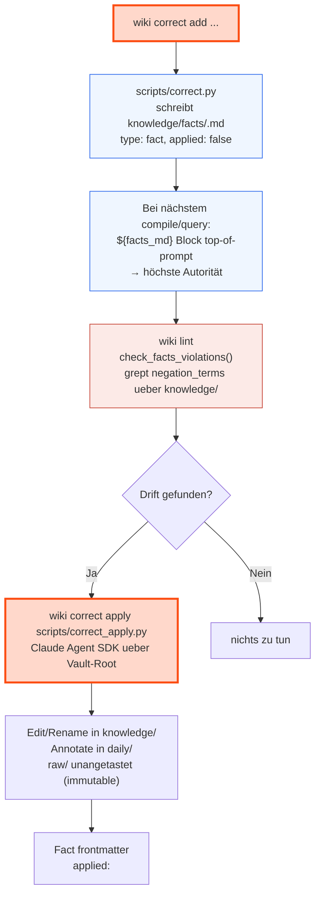

### Anatomie eines Fact-Files

`knowledge/facts/<slug>.md`:

```yaml
---
title: "Senkrechtstarter award (NOT won)"
type: fact
status: negation              # negation | disambiguation | clarification
created: 2026-05-02
updated: 2026-05-02
applied: false                # oder ISO-Zeitstempel nach apply
negation_terms:
  - "senkrechtstarter award"
  - "won the senkrechtstarter"
---

We did NOT win the Senkrechtstarter award. Strike any article asserting otherwise.
```

### Status-Tabelle

| Status | Wofür | Lint-Verhalten |
|--------|-------|---------------|
| `negation` | Falsche Behauptung streichen ("X gewinnt Award" wenn nicht passiert) | grep `negation_terms` über alle Non-Facts → warning pro Hit |
| `disambiguation` | Namen-Konflikt klären ("township" → Fleet, nicht Township-X) | structural lint überspringt; der `apply`-Schritt erledigt File-Renames + Wikilink-Fixes |
| `clarification` | Faktische Korrektur ohne Negation/Renaming | structural lint überspringt; Compile/Query nutzen den Fact als Kontext |

### Integration mit anderen Prozessen

- **Compile (§3):** `prompts/compile_main.md` öffnet mit `## Hard facts (override anything in the source material)`. Der Compiler sieht die Facts vor jedem Source und ist instruiert, widersprechende Claims weder zu schreiben noch in bestehenden Articles zu belassen.
- **Query (§6):** Identisch — `prompts/query_main.md` und `prompts/query_file_back.md` haben den `${facts_md}` Block direkt nach dem System-Prompt.
- **Lint (§6):** `check_facts_violations()` greppt jeden `negation_terms` Eintrag (case-insensitive) über alle Non-Facts Knowledge-Files; Hits → `warning`-Issue mit Hint auf `wiki correct apply <slug>`.
- **Article-Type-Lint:** `FOLDER_TO_TYPE["facts"] = "fact"` — Facts werden gegen ihren Typ gecheckt wie jede andere Substrate.

### Apply-Pfad (Agentic Propagator)

Falls Drift bereits ins Wiki gelangt ist (z.B. die `negation_terms` matchen oder eine Disambiguation viele Files betrifft), erledigt `wiki correct apply <slug>` die Propagierung:

```bash
wiki correct apply senkrechtstarter-award-not-won           # full agent run
wiki correct apply township-project-fleet --dry-run         # plan only
```

Was passiert:

1. `scripts/correct_apply.py` liest das Fact-File und rendert `prompts/correct_apply.md`.
2. Spawned Claude Agent SDK mit `cwd=<vault-root>`, `permission_mode=acceptEdits`, allowed_tools = `Read, Write, Edit, Glob, Grep, Bash`. Model = `CONFIG.models.compile_model` (Opus by default — Apply ist selten und teuer).
3. Der Agent grept den ganzen Vault, editiert/strikes Claims in `knowledge/`, prepended Correction-Notes in `daily/`, lässt `raw/` unangetastet (Layer-Konvention: raw ist immutable). Bei Disambiguation darf er via `git mv` umbenennen und Wikilinks sweepen.
4. Nach Erfolg setzt `correct_apply.py` das Fact-Frontmatter auf `applied: <iso-ts>` (mit `.bak.<ts>` Backup).

### Edge Cases

- **Fact-File fehlt** beim Compile/Query: `read_hard_facts()` returned `(no hard facts recorded)` als Placeholder — Prompt bleibt syntaktisch valide, kein Crash.
- **`negation_terms` leer oder fehlt:** Lint überspringt das Fact in `check_facts_violations()`, der Prompt-Block bleibt aber aktiv (LLM-Override).
- **`applied: false` für ewig:** Akzeptiert. Apply ist optional. Lint surface-t Drift auch ohne Apply.
- **Apply schlägt mid-run fehl:** Vault-State ist möglicherweise teil-aktualisiert. Git-Working-Tree zeigt Diff; User entscheidet ob commit, revert, retry. Kein automatischer Rollback in v1.
- **Fact wird gelöscht:** `wiki correct remove <slug>` legt ein `.bak.<ts>` an, dann unlink. Kein Cascade-Cleanup über Knowledge-Articles, die in der Zwischenzeit auf den Fact reagiert haben — Annahme: ein gelöschter Fact ist eine widerrufene Korrektur, kein "wieder behauptbarer" Claim.

---

## 14. Agent Tasks

> Eingeführt mit M004. Generischer Runner für agentic Tasks (Claude SDK), die per Markdown-Datei deklariert werden — kein Engine-Code-Change nötig um eine neue Task hinzuzufügen.

### Flow

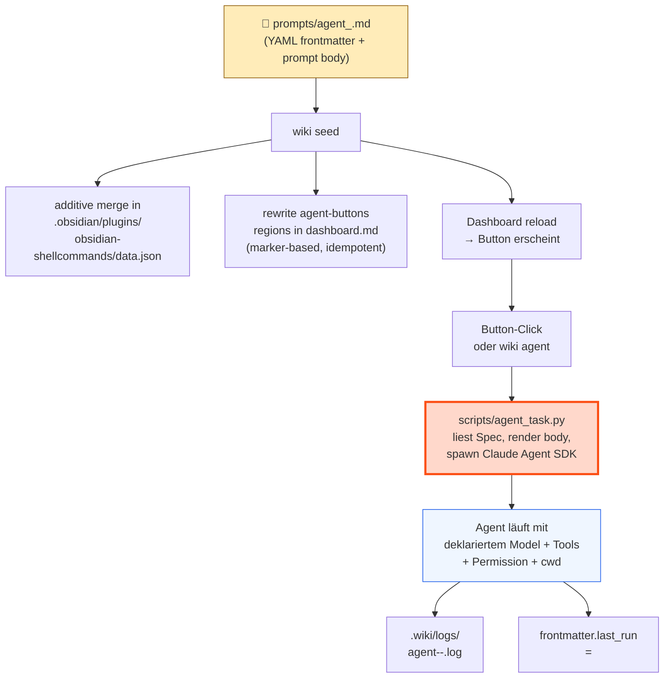

### Anatomie einer Task-Definition

`prompts/agent_<id>.md`:

```yaml
---
id: summarize-day                    # required, matches filename
title: "Summarize today's daily log" # required, shown in --list
description: "..."                   # optional
model: claude-haiku-4-5              # optional, defaults to CONFIG.models.compile_model
allowed_tools: [Read, Edit, Write]   # required, non-empty subset of valid SDK tools
permission_mode: acceptEdits         # default | acceptEdits | plan | bypassPermissions
max_turns: 8                         # 1..100
cwd: vault                           # vault | wiki
button:                              # optional — drop to omit Dashboard wiring
  label: "📅 Summarize day"
  style: primary                     # primary | default | destructive | plain
  tooltip: "..."
  shell_command_id: agent-summarize-day  # optional, defaults to agent-<id>
last_run: false                      # written back by runner; do not author
---

You are a daily-log summarizer. Read `daily/${today}.md`. ...
```

### Substitution-Variablen

Built-in (immer verfügbar):
- `${today}` — `YYYY-MM-DD`
- `${now}` — ISO-Zeitstempel mit Timezone

Operator-bereitgestellt via `wiki agent <id> --var key=value` (repeatable).

### CLI

| Befehl | Wirkung |
|--------|---------|
| `wiki agent <id>` | Task ausführen, Log + last_run schreiben |
| `wiki agent <id> --dry-run` | Resolved Spec ausgeben, kein SDK-Aufruf |
| `wiki agent <id> --var k=v --var k2=v2` | Body-Substitution |
| `wiki agent --list` | Alle Tasks mit Title + Button-Marker + last_run |

### Auto-Wiring durch `wiki seed`

`scripts/agent_buttons.py` discovered alle `prompts/agent_*.md` mit `button:` Frontmatter. `lib/seed.sh` ruft das auf zwei Pfaden:

1. **Shell-Commands additiver Merge:** `_merge_agent_shell_commands()` jq-merged neue `agent-<id>` Einträge in `.obsidian/plugins/obsidian-shellcommands/data.json`. Bestehende User-Einträge bleiben.
2. **Dashboard Region-Replace:** `_rewrite_dashboard_agent_buttons()` ersetzt zwei marker-begrenzte Bereiche in `dashboard.md`:
   - `<!-- agent-buttons:begin -->` ... `<!-- agent-buttons:end -->` — inline `` `BUTTON[id]` `` Referenzen
   - `<!-- agent-button-defs:begin -->` ... `<!-- agent-button-defs:end -->` — hidden Meta-Bind Definitionen

Idempotent — zweiter Lauf produziert keinen Diff.

### Edge Cases

- **Spec ohne `button:`** — Task ist via `wiki agent <id>` aufrufbar, erscheint aber nicht im Dashboard.
- **Spec invalide** (fehlende Felder, unbekannte Tools) — `parse_spec` raised `SpecError` mit klarer Message; `wiki agent --list` skippt invalide Specs aber zeigt sie als Fehler unten in der Liste.
- **`hidden: true`** auf Meta-Bind Defs — Block-Definition existiert, rendert aber nichts. Inline `` `BUTTON[id]` `` Referenzen nutzen die versteckte Def und rendern den Button an der Inline-Position.
- **Marker fehlen in dashboard.md** — `update_dashboard()` warned und skippt; safe für custom-edited dashboards.
- **Operator löscht Spec-File** — Auto-pruning ist NICHT Default. Buttons bleiben in shell-commands data.json + dashboard.md zurück, bis manuell entfernt. `--prune-agent-buttons` Flag deferred ins Backlog.

