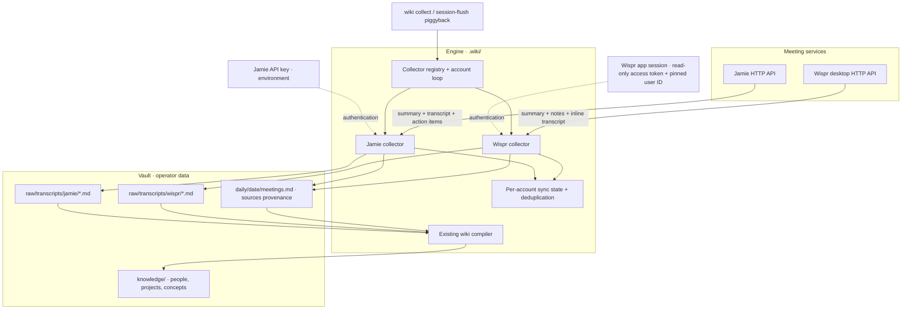

# Meeting collector architecture

Jamie and Wispr Flow use the same collector pipeline: direct HTTP requests,
one Markdown source per meeting, daily provenance, then the existing compiler.
Authentication and the provider's API contract stay inside each collector.

## Wispr request and persistence

1. Resolve configured `personal.accounts.<id>.wispr` accounts. Read the current
   desktop access token on each request and verify the configured user ID;
   alternatively use the explicitly configured token environment variable.
2. Call `POST /api/v1/meetings/sync` with `meetings: []` and
   `supports_refined_stamp_fetch: false`. Follow response cursors to retrieve
   the full inline meeting content. Requests upload no meetings or recording state.
3. Write finalized, nonempty meetings to stable Markdown paths. Content hashes
   prevent duplicate imports; later edits update the existing source.
4. Add a daily meeting entry with its canonical source in `sources:` frontmatter.
   Keep sync watermarks unchanged while content is pending or a run is incomplete.
5. The normal compile pipeline distills these sources into knowledge articles.

The automatic Wispr collector runs on session flush when its six-hour cooldown
has elapsed and an account is configured. It is a piggyback, not a standalone
six-hour timer. Manual collection uses `wiki collect wispr`.

No MCP server or local meeting-database import is involved. The desktop app
renews its own session; the collector never refreshes or writes app credentials.
The desktop backend is not a published stable API. Empty recordings stay pending
until usable content appears and do not create empty source files.

See [Wispr setup and API contract](setup-wispr.md), the
[high-level overview](overview.png), and the
[full cognitive architecture](architecture.png).
